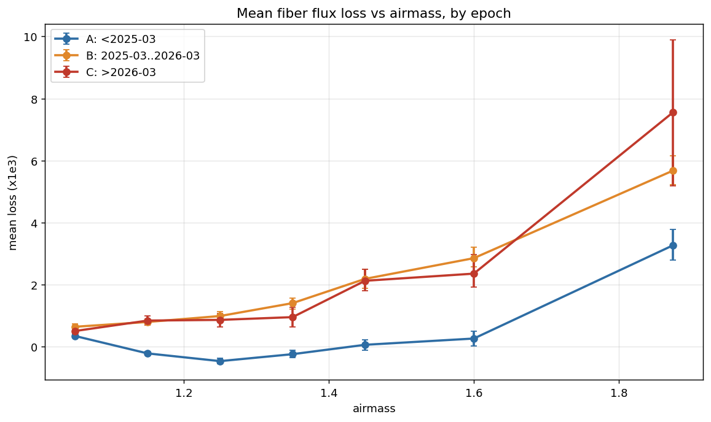
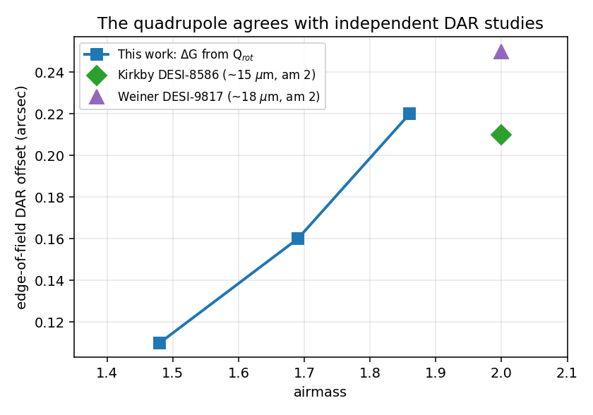
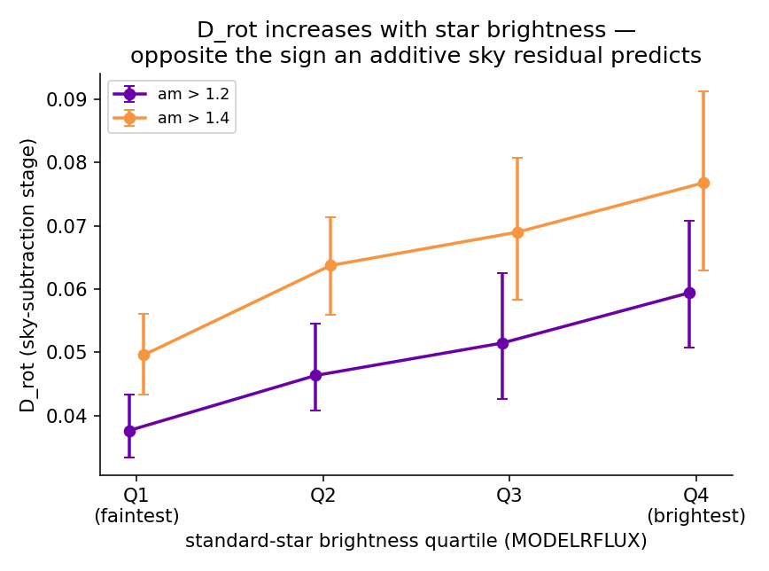
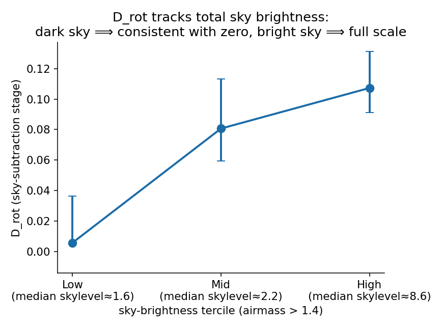

# Differential Atmospheric Refraction and DESI Standard-Star Fiber Loss: A Data-Based Study

This report details the findings of a study to measure differential atmospheric refraction (DAR) fiber
loss directly from DESI survey data and compare it against the existing model- and telemetry-based studies.
The study reaches two results: the **quadrupole** component of the loss is real DAR and reproduces the independent
studies (with a clear observing-strategy implication — observe near transit); the **dipole** component, which
initially looked like DAR, is **not** — it is a bias introduced by the flux-loss measurement itself, at the
sky-subtraction step of the spectroscopic pipeline, and it is not specific to the metric we used. The
sky-subtraction finding is handed to the `desispec` maintainer.

---

## Executive summary

Much of the remaining DESI schedule targets southern fields (Dec −10° to −30°) at sustained high airmass,
where DAR is expected to move star images relative to their once-placed fibers and cause flux loss. We set
out to see that effect **directly in survey data** — using the standard-star flux-loss metric `RCALIBFRAC`
(`loss = 1 − RCALIBFRAC`) — and to compare it against the model/telemetry studies of Weiner (DESI-9817),
Kirkby (DESI-8586), and the ADC/refraction analyses of Lampton (DESI-0309) and Joyce (DESI-9097). Decomposing
the loss in a derotated, zenith-aligned focal-plane frame produced two components, and they have opposite
fates:

- **The quadrupole (`Q_rot`) is real DAR, and it is externally confirmed.** It is the field-differential
  refraction drift that accumulates during the exposure. Converted to an edge-of-field offset it matches
  Kirkby and Weiner to 10–20%, it is reproduced by an independent astrometric measurement (guide-star
  residuals), and it is present in the directly-measured geometric offset field (dither sequences). Its
  airmass and hour-angle dependence give a concrete observing lever: **proximity to transit**, not Dec or
  airmass alone, minimizes the drift.
- **The dipole (`D_rot`) is not DAR.** It is roughly twice the quadrupole and has **no counterpart in any of
  the independent studies** — Weiner and Kirkby predict/measure only a quadrupole. A direct, independent
  measurement of the real geometric fiber-to-light offset (the dither technique) shows **no** such dipole,
  while the same data reproduces the quadrupole cleanly. The dipole is instead produced **inside the flux-loss
  measurement**, and is localized to the **sky-subtraction** step of the pipeline. It mimics DAR — zenith-tied
  and airmass-growing — because the night-sky brightness it couples to is itself zenith-tied and grows with
  airmass, which is exactly why it was initially read as a refraction effect.

- Based on multiple independent tests we are very confident in these results: The rotating dipole and quadrupole (`D_rot`/`Q_rot`) are real signals; `Q_rot` is
  real DAR matching three external estimates; the dipole is **not** a geometric fiber-to-light offset (dither)
  and not in the stellar model (model-vs-data split), and it reproduces on all point sources with
  external photometry — so it is a flux-processing effect in point-source spectrophotometry, not DAR.
- We have a strong lead, but not a confirmed diagnosis that the dipole enters *specifically* at the `subtract_sky`
  step (rather than an adjacent step). This rests on our external reimplementation of the pipeline, validated only
  at its final output. This should be verified by the pipeline authors in the real code path.

A separate result — **Finding 1**, a mid-2025 shift in the loss *level* caused by a calibration change in how
`RCALIBFRAC` is built (desispec PR #2484) — turned up along the way and is included as the first of two
`RCALIBFRAC` construction caveats. The practical takeaway: `RCALIBFRAC` is not a clean flux-loss estimator
for a DAR study — its sky-subtraction step imprints a spurious zenith-tied dipole — but the physical DAR
signal (the quadrupole) and its scheduling implication survive intact. What the sky-subtraction coupling means
for DESI flux calibration more broadly is beyond this study's scope and is handed to the `desispec` maintainer
(Julien Guy).

**Data.** The pooled `calibstars` dataset — one row per VALID standard-star measurement across DESI
DARK/BRIGHT/DARK1B/BRIGHT1B science exposures, with focal-plane X/Y, `RCALIBFRAC`, `loss`, `airmass`, `seeing`,
`night` — joined to a per-exposure pointing/timing table from the exposure database (RA/Dec, hour angle,
parallactic angle, zenith distance, exposure time, ADC prism angles, hexapod rotator rate). Convention:
focal plane +Y = North, fixed to the sky by the equatorial mount; parallactic angle `q` derotates the
frame so the zenith direction is fixed.

---

# Part I — Motivation: an independent, data-based probe of DAR fiber loss

DAR at high airmass moves star images relative to their once-placed fibers and is expected to cause flux loss
— an effect that matters for the more-southern, higher-airmass fields much of the upcoming DESI program will
use. The effect had been characterized before, but from **models and telemetry rather than survey flux
data**: **Weiner (DESI-9817)** from an astrometric/geometric simulation of the displacement field, and
**Kirkby (DESI-8586)** from the guider's own guide-star-motion telemetry at high airmass. The
atmospheric-dispersion-corrector (ADC) behavior had likewise been analyzed from first principles (**Lampton,
DESI-0309**; **Joyce, DESI-9097**). What was missing was an **independent, on-sky, flux-based** measurement — a
way to see the effect directly in the survey's own standard-star throughput and compare it against those
studies.

This study set out to provide exactly that. We identified **`RCALIBFRAC`** — the per-exposure standard-star
r-band measured-over-model flux ratio produced by the pipeline — as a readily available data-based flux-loss
metric, and decomposed its airmass- and parallactic-angle dependence into the multipole pattern DAR predicts.
The result had two parts: a **quadrupole** we could check against the other work (Part III), and a **rotating
dipole** with no counterpart in any of it (Part IV). That unexplained dipole — real, reproducible, zenith-tied,
airmass-growing, and absent from every independent treatment — became the subject of the investigation that
follows. Its resolution turned out to be about the metric, not the atmosphere.

---

# Part II — The detection: the loss pattern and its structure

## 1. Standard-star loss grows with airmass — and a calibration caveat (Finding 1)

Standard-star loss grows steeply with airmass, the qualitative signature a DAR study is looking for. But
before reading any of it as atmosphere, one confound had to be removed: the loss *level* also shifted in time,
for a reason that has nothing to do with the sky.

Splitting the archive into three epochs — **A** before 2025-03 (a flat baseline), **B** from 2025-03 to the
2026-03-07 PlateMaker change, **C** after — and comparing mean loss vs airmass:

| airmass | A (<2025-03) | B (2025-03→2026-03) | C (>2026-03) |
|---|---|---|---|
| **1.0–1.2** (low, DAR-free) | 0.12 [0.08, 0.15] | 0.70 [0.64, 0.76] | 0.67 [0.57, 0.76] |
| **1.5–2.05** (high) | 0.97 [0.74, 1.16] | 4.11 [3.83, 4.39] | 3.89 [3.12, 4.59] |

(mean loss ×10⁻³, bootstrap-over-exposures 16–84% intervals.)

**Finding 1 — a calibration-level shift, not the atmosphere and not the PlateMaker.** The A→B jump is large at
*both* airmasses, including low airmass where DAR is negligible and positioning cannot produce a loss — so it
is a change in how the loss is *measured*, not in the sky. The B→C step is null (the PlateMaker change added
nothing). The origin was identified with the DESI calibration team: the mid-2025 addition of a point-source
**flat→psf aperture correction** to `RCALIBFRAC` (desispec **PR #2484**, released 0.70.0); because `daily` is
not uniformly reprocessed, it appears as a step across the archive at the deployment date, at all airmass.
**This is the first of two `RCALIBFRAC` construction caveats in this report** — a reminder that the metric is
a pipeline product with its own subtleties, which becomes the central theme of Part IV. For the DAR analysis
that follows, epochs are handled so the level shift is not mistaken for airmass dependence.

## 2. The loss decomposes into a radial monopole, a dipole, and a quadrupole

Fixing the focal plane to the sky (equatorial mount) and derotating each exposure by its parallactic angle `q`
so the zenith direction is common, the per-star loss is regressed against a radial term plus fixed and
rotating dipole and quadrupole components (`analysis/dar_dipole/fit_dipole_quadrupole.py`). Three spatial
structures appear:

- a **radial monopole** — an isotropic center-to-edge gradient that *flattens* (not steepens) with airmass;
  it is driven largely by **seeing/PSF broadening** interacting with a radially-varying fiber coupling, a
  general (non-directional) atmospheric effect, not DAR (Appendix A). It is set aside for the DAR question.
- a **rotating dipole** (`D_rot`) and a **rotating quadrupole** (`Q_rot`), both tied to the zenith direction
  and both growing with airmass. These are the DAR-candidate signals.

Modeled as `loss ≈ |δ₀ + G·r|²/2σ²`, the **quadrupole** is the field-differential `|G·r|²` term and the
**dipole** is the cross-term `δ₀·G` — nonzero only if there is a genuine coherent whole-field offset `δ₀`
between the fiber array and the star field. Measured amplitudes (complete population, edge-normalized units,
bootstrap CIs over exposures):

| airmass cut | D_rot | Q_rot | D_rot / Q_rot |
|---|---|---|---|
| > 1.4 | 0.035 | 0.017 | 2.03 [1.94, 2.12] |
| > 1.6 | 0.056 | 0.029 | 1.93 [1.82, 2.10] |
| > 1.8 | 0.080 | 0.046 | 1.75 [1.55, 2.04] |

Both components rotate with `q` (a `q`-permutation null collapses the rotating dipole, 0.044 → 0.002,
confirming it is genuinely parallactic-locked, not a fit artifact), and both were independently reproduced
from a fresh database rebuild (the "foundation check"). So both are real, zenith-tied signals. The rest of the
report asks what each one *is*: the quadrupole (Part III) and the dipole (Part IV).

---

# Part III — The quadrupole is real DAR, and it sets the observing strategy

## 3. The quadrupole matches the independent DAR studies

The quadrupole is the **field-differential** intra-exposure DAR drift: fibers are placed on their targets once
(fiberview RMS ~3 μm, small against the 107 μm / ~1.5″ fiber), then locked while the telescope tracks for the
full exposure; as the field tracks, the refraction offset — which grows with airmass and points toward the
zenith — changes differently across the 3° focal plane, so stars at different field positions drift off their
fixed fibers by different amounts. That field-differential drift is the `|G·r|²` quadrupole. (A whole-field
*uniform* drift would be a dipole, `δ₀`; Part IV shows there is no real geometric dipole — so the surviving
physical DAR loss is the quadrupole.)

Converting the measured `Q_rot` to a physical edge-of-field offset (`ΔG = σ_eff·√(2·Q_rot)`, `σ_eff ≈ 52 μm`
from the `desimodel` `FastFiberAcceptance` model) gives 8.0 / 11.6 / 15.5 μm (0.11″ / 0.16″ / 0.22″) at
airmass 1.48 / 1.69 / 1.86 — matching Kirkby's guider sky-motion estimate (~15 μm at airmass 2, DESI-8586) and
Weiner's astrometric-geometry estimate (~18 μm at airmass 2, DESI-9817) to 10–20%:

**Three independent methods converge on the quadrupole's physical scale**: this loss-based fit; Weiner's and
Kirkby's model/telemetry estimates; and — established in Part IV — a second astrometric measurement from
guide-star residuals, plus the directly-measured dither offset field. This is the anchor of the whole study:
the quadrupole is DAR, verified outside our own pipeline.

*A refinement, developed in Part V.* `Q_rot` is not entirely free of the sky-subtraction effect that dominates
the dipole — it carries a minority artifact component at high airmass — so the full-population number quoted
above is slightly sky-boosted. The sky-independent (clean) DAR quadrupole, ~11 μm at high airmass, is
independently confirmed there by the intra-exposure guide-star drift. The conclusion is unchanged; see Part V.

## 5. The physics and the observing lever: proximity to transit

The intra-exposure drift depends on how the refraction offset *changes* while tracking. The offset has
magnitude ∝ `tan z`, points toward the zenith, and changes two ways as the Earth turns:

- **magnitude** (offset lengthens): rate ∝ `sec²z·(dz/dt)`, and `dz/dt ∝ sin H` → **zero at the meridian**;
- **direction** (offset rotates): rate ∝ `tan z·(dq/dt)`, and `dq/dt = ω·cosφ/sin z` at transit →
  **first-order and near-maximal at the meridian**.

So near the meridian — where DESI observes — the magnitude is frozen and the drift is dominated by the
parallactic **rotation**, with rate `tan z·dq/dt = ω·cosφ·sec z`, present right at transit and growing with
`sec z = airmass`. The field-differential of this drift across the 3° field is the quadrupole, and it grows
with airmass, exactly as measured. The drift also accumulates with **exposure time**: holding seeing and
airmass fixed, doubling the exposure time raises the within-exposure signature ~2.6× — the effect is genuinely
time-integrated.

**The observing-strategy implication (grounded on the quadrupole + exact geometry).** Worked example — Dec −25°,
20-min exposure, fiber 300 mm from center:

| quantity | value |
|---|---|
| target drift over the exposure (parallactic rotation ~5°) | ~28 μm |
| residual RMS even with perfect *midpoint* positioning | ~8 μm |
| midpoint position − *integrated-loss-optimal* position | ~0.1 μm *(only if the fiber is placed at the midpoint — see Update 2026-08-10; it currently is not)* |

- **Proximity to transit is the dominant lever.** For a fixed field the drift is minimized at transit and only
  grows off-meridian (as `dq/dt` falls, `tan z` rises and the previously-zero magnitude drift switches on). A
  20-min exposure at Dec −25° drifts ~26 μm at transit, ~35 μm at HA = 1 h, ~75 μm at 2 h. Transit is already
  the optimal hour angle for any field; the drift cannot be scheduled away, only shortened. From the
  complementary side, at matched *current* airmass an off-transit field accumulates `|Δairmass|` ~30× faster
  than one at transit — so a deep-south field near transit can be safer than a moderate-Dec field well off
  transit, despite higher raw airmass. This follows from exact spherical geometry, not a fitted model.
- **Cap exposure duration at high airmass** — the drift accumulates ∝ T, so shorter or split exposures reduce
  it; the ~1–2% loss is the quantity to weigh against the ~2-min-per-restart overhead (cost/benefit is out of
  scope here).
- **Positioning — the midpoint is optimal, but the pipeline is not placing there** *(updated 2026-08-10)*. The
  exposure midpoint coincides with the integrated-loss optimum to ~0.1 μm *if the fiber is placed there* — but a
  fiber-placement timing bug currently puts it at ~the exposure **quarter-point** (see the Update below), so
  positioning is in fact a real, recoverable lever. The effect remains **invisible to short (3-min) dither
  sequences** used to validate positioning, which accumulate essentially no rotation drift by construction.
- **Treat Dec ≤ −28° as a distinct, harder regime.** The DAR drift is larger there (higher airmass), and
  additionally the ADC has a hard **ZD = 60° / airmass 2.0** limit beyond which it no longer corrects the
  chromatic *dispersion* (a separate, secondary apparent-loss channel; Dec ≤ −28° fields never drop below it
  even at transit). The `r`-band `RCALIBFRAC` is largely immune to that dispersion channel, and no
  far-southern science sample exists yet to measure it — flagged, not quantified.

> **Update (2026-08-10) — fiber-placement midpoint bug (found in a follow-up code review).** The
> "positioning is not a lever" reading above is **superseded**. The optimizer's fiber-placement midtime should
> be `min(esttime, 1800 s)/2` — the flux-weighted midpoint of the (possibly split) exposure, where `esttime` is
> the dynamic scheduler's conditions-aware duration estimate (≈ `exptime`). A miscommunication applied a factor
> of ½ on **both** the control side and inside PlateMaker, so the robots are optimized for `min(esttime,1800)/4`
> — roughly the **exposure quarter-point, not the midpoint**. (A +120 s setup overhead is added *after* the ½
> and is common-mode between the intended and buggy paths, so it does not offset the error.) Over the non-split
> sample (`esttime ≤ 1800`, ~68% of exposures): the fiber is optimized for ~⅓ of the way through the exposure —
> a **median ~184 s too early, with 93% of exposures placed too early**; correcting the double-½ moves it ~336 s
> later, onto the true midpoint.
>
> Two consequences, kept separate:
>
> - **The dipole / sky-subtraction result — this report's headline — is unaffected.** A mis-timed placement is a
>   purely *geometric* effect, and the boresight translation a dipole would ride on is removed by the guider in
>   real time; what survives is a *field-differential* (scale+shear → **quadrupole**) residual. It adds to the
>   real `Q_rot` / `L_field` channel and **cannot** contribute to the rotating dipole `D_rot` (the two are
>   orthogonal in the fit). *(A prior `reqtime`/`exptime` midpoint elimination in the superseded dipole handoff
>   regressed against `reqtime − exptime`, now known to be the wrong variable — but the dipole ruling never
>   rested on it; it rests on the dither geometry, which shows no rotating dipole.)*
>
> - **Only the ~0.1 μm "midpoint-optimal" figure changes.** At the midpoint the positioning residual is
>   second-order (~0.1 μm); at the quarter-point it is first-order. An order-of-magnitude estimate from the
>   worked example above is a **few μm / sub-1 % loss** — a real, systematic, and **fixable** placement penalty
>   already baked into every measured exposure. The exact per-exposure penalty (the proper successor to the
>   0.1 μm) is deferred to a post-shutdown recomputation of the field-differential integral with the reference
>   time set to `esttime/4`, restricted to `esttime ≤ 1800`.
>
> **Status:** bug confirmed; fix planned after the 2026 summer shutdown. Splits are excluded above because their
> `esttime` is a *tile-level* estimate and the placement math is only clean for single integrations — note that
> splits are disproportionately the high-airmass / long exposures where this penalty is *largest*, so the
> non-split numbers characterize the mechanism but under-represent the worst case.

### The quadrupole itself confirms the lever — directly, in the data, artifact-free

Rather than rely on the total loss — whose dipole is a metric artifact (Part IV) — we can test the scheduling
lever on the **real-DAR quadrupole alone**. Fitting `Q_rot` (with the artifact dipole separated out by the
same decomposition) as a function of the **intra-exposure airmass excursion `|Δairmass|`** — how much the
airmass changes during the exposure, which is small near transit and grows off-transit and with exposure
duration — at **controlled current airmass**:

With the mean airmass held fixed (~1.63), `Q_rot` grows from **0.015 [0.014, 0.016]** for near-transit
exposures (`|Δairmass|` ≈ 0.03) to **0.026 [0.025, 0.027]** off-transit (`|Δairmass|` ≈ 0.10) — a ~70%
increase, driven by the excursion, not the (matched) airmass (the residual 0.04 airmass difference between
bins accounts for < 15% of the change; the rest is `|Δairmass|`). Because this uses **only the quadrupole**,
it is an **artifact-free, data-based** confirmation of the observing lever, independent of the metric-dipole
issue: the real DAR loss is at a flat minimum near transit and grows with off-transit excursion and exposure
duration. This supersedes — and vindicates — the original total-loss-vs-hour-angle evidence, which is not
reproduced here because its dipole component is now understood to be a metric artifact. **Observe near
transit; cap high-airmass exposure duration.**

---

# Part IV — The dipole is not DAR: the investigation

The dipole is real, zenith-tied, airmass-growing, and ~2× the quadrupole — yet it has **no counterpart** in
Weiner or Kirkby, both of which predict/measure only a quadrupole. That anomaly drove a direct test: is there
a coherent whole-field offset `δ₀` between the fibers and the star field at all?

## 6. Not a geometric fiber-to-light offset (the dither)

DESI's **dither sequences** (Schlafly et al. 2024, arXiv:2403.05688) step stars across their fibers in a known
pattern and fit the flux response to recover, per star and per exposure, the **actual geometric fiber-to-light
offset** — a completely different measurement technique from `RCALIBFRAC` (a geometric centroid fit, not a
flux ratio), and therefore an independent witness to whether `δ₀` is physically real. Fitting the same
derotated decomposition to the real offset field (night-clustered bootstrap over the 12 independent nights):

**The dipole is flat, ~5× too small, and its slope vs tan(z) straddles zero; the quadrupole, from the exact
same data, grows and tracks `Q_rot`.** Because both come from the same dataset with the same coverage, any
"thin sample / diluted signal" explanation that would flatten the dipole would flatten the quadrupole's growth
too — it doesn't. This is a genuine positive control: the measurement resolves the quadrupole cleanly and sees
no dipole. **So there is no coherent geometric offset — starlight is not centroiding off the fiber in a
zenith-tied way at the scale the loss dipole implies.** (This is also why the surviving physical DAR loss is
the quadrupole: the geometry contains a field-differential term and no uniform one.)

## 7. Not the stellar model, and not the aperture correction

`RCALIBFRAC` = (measured, aperture-corrected r-band flux) / (model r-band flux, from the stellar fit). Two
construction candidates were tested directly against the production pipeline code:

- **The point-source aperture correction (PR #2484 — the Finding-1 term).** Tested two ways: a deployment-date
  epoch split (the dipole is at full strength *before* the correction existed — epoch A: 0.0341 at am>1.4) and
  a direct fit to the correction factor itself (0.0003–0.0008″, 50–100× too small). Not the source.
- **The stellar flux-calibration model.** Reconstructing `RCALIBFRAC` from its raw ingredients and fitting the
  dipole separately to the model flux and the measured flux puts **essentially all of it in the measured flux
  term** (data-term D_rot 0.041→0.094 vs model-term 0.013–0.019, flat). The dipole is in the measured r-band
  flux itself, not the model.

## 8. Localized to sky subtraction

Snapshotting the measured flux at each stage of its construction and refitting the dipole:

Fiberflat correctly removes the *fixed* instrument-frame dipole; the rotating dipole roughly doubles, and gains
its characteristic airmass growth, **specifically at sky subtraction**; the aperture correction changes nothing
(a third confirmation it is not the source). A smaller rotating dipole is already present in the raw extracted
flux, but sky subtraction is where most of the amplitude appears.

## 9. What kind of mechanism — discriminators

Three discriminators pin the *character* of the effect (all on the sky-subtraction-stage flux):

- **Bright-vs-faint:** `D_rot` **increases** with star brightness (faster than flux) — opposite the ∝1/flux of
  an additive sky residual, ruling that out.
- **Sky level:** `D_rot` scales strongly with sky brightness (dark → ~0, bright → full amplitude) — the effect
  needs a real sky background.
- **Sky-residual at sky fibers:** measuring (data − sky model) directly at `OBJTYPE=='SKY'` fibers gives a null
  (~350–800× below `D_rot`, flat) — the sky *model* is not spatially wrong; the effect requires a **star's own
  signal** to be present.

Together: the bias is in the sky-subtracted flux values, requires the star's own signal, and scales with both
star brightness and sky level. Three specific named mechanisms inside `subtract_sky` were then tested and each
came back null: the `_model_variance` ivar inflation (uses the mean sky, not the fiber's own flux — cannot
couple to star brightness); the sky-line throughput correction (diluted in the broad band); and a **bisector
test** ruling out the entire class of inverse-variance-weighting artifacts in one shot (recomputing the flux
as an unweighted mean, matching the model, leaves `D_rot` unchanged). So the effect is in the flux itself, not
the weighting — and not any single named ingredient we could test from outside.

---

# Part V — The artifact's reach, and the clean DAR confirmed

Two results extend the picture: the dipole artifact is not specific to `RCALIBFRAC` (it reaches all
point-source spectrophotometry), and the artifact also touches the quadrupole — but separating the two halves
of the quadrupole independently confirms the real DAR.

## The dipole is not specific to `RCALIBFRAC`: a direct point-source photometry check

If the dipole is a genuine property of the sky-subtracted flux, it should appear in *any* counts-based metric,
not just `RCALIBFRAC`. We built the metric a pipeline calibration expert would use to check throughput —
**measured spectrograph counts/s vs external photometry, over all point sources** — which shares *nothing* with
`RCALIBFRAC` except the sky-subtracted flux: no stellar model (external Legacy photometry as the reference), no
flux calibration (raw counts/s), and no standard-star selection (`MORPHTYPE=='PSF'`, every point source on the
plate, 5–6× the statistics). Fitting the same derotated decomposition to `log(counts/s) − log(FLUX_R)`:

| am cut | n point sources | D_rot | Q_rot | D_rot / Q_rot |
|---|---|---|---|---|
| > 1.2 | 596,155 | 0.0515 [0.0462, 0.0563] | 0.0341 [0.0302, 0.0386] | 1.51 |
| > 1.4 | 470,451 | 0.0661 [0.0588, 0.0733] | 0.0396 [0.0359, 0.0442] | 1.67 |
| > 1.6 | 328,506 | 0.0769 [0.0644, 0.0884] | 0.0490 [0.0423, 0.0561] | 1.57 |
| > 1.8 | 158,170 | 0.1019 [0.0860, 0.1159] | 0.0589 [0.0505, 0.0697] | 1.73 |

**Both the dipole and the quadrupole survive, growing with airmass, with `D_rot/Q_rot ≈ 1.5–1.7`** — the same
signature as `RCALIBFRAC`'s, on a fully independent metric. The quadrupole's presence is the internal validator
(it should reproduce the real DAR, and it does); read against it, the dipole is trustworthy, not a metric
peculiarity. Two consequences:

- **The dipole is not specific to `RCALIBFRAC`.** It is in the sky-subtracted counts themselves, which any
  counts-based metric inherits — including the standard photometry-comparison metric. There is no clean
  *counts-based* DAR metric until the sky-subtraction coupling is understood; the dither (geometry) remains
  the only artifact-free probe.
- **It is not a standard-star selection effect.** This sample is every point source on the plate, not the
  curated calibrators.

## The artifact also reaches the quadrupole — and the clean DAR is confirmed geometrically

The dipole is not the only multipole the sky-subtraction artifact touches. Splitting `Q_rot` by sky brightness
at controlled airmass — the same discriminator that identified the dipole — shows the quadrupole rises with sky
level too:

| airmass | low-sky `Q_rot` → ΔG | high-sky `Q_rot` → ΔG |
|---|---|---|
| > 1.4 | 0.0141 → 8.7 μm | 0.0193 → 10.2 μm |
| > 1.6 | 0.0183 → 9.9 μm | 0.0346 → 13.7 μm |
| > 1.8 | 0.0227 → 11.1 μm | 0.0536 → 17.0 μm |

`Q_rot` rises with sky, and the excess grows with airmass (up to ~2.4× in the brightest-sky, highest-airmass
bin). So the quadrupole is a mix — a real DAR component (the sky-independent baseline, nonzero and
airmass-growing) plus a minority sky-subtraction artifact (the sky-dependent excess), the same effect that *is*
the dipole. This unifies the picture: the sky-subtraction bias contaminates the whole loss decomposition — the
dipole entirely (no real DAR dipole exists) and the quadrupole partially (a real DAR quadrupole exists
underneath). It is why the dipole vanishes at dark sky while the quadrupole does not.

The clean DAR is then the sky-independent (dark-sky) `Q_rot`, ~11 μm at high airmass — and it is independently
confirmed by geometry. Because the loss is intra-exposure-accumulated (fibers placed once, the star drifts
during the exposure), the loss-relevant DAR quantity is the intra-exposure guide-star *drift*, computed
directly from the per-frame ETC offsets (accumulated shear relative to the placement epoch). It resolves the
apparent scatter among the DAR estimates into one coherent picture (edge-equivalent, am > 1.8):

| quantity | ΔG | what it is |
|---|---|---|
| static snapshots (PMGWCS shear, dither) | ~7 μm | single-epoch — miss the accumulation |
| intra-exposure zenith-projected drift | 11 μm | directional, DAR-loss-relevant |
| RCALIBFRAC dark-sky `Q_rot` | ~11 μm | the clean loss — matches |
| intra-exposure undirected RMS drift | 15 μm | motion amplitude, all directions |
| Kirkby (DESI-8586) | ~15 μm | matches the undirected drift |
| Weiner (DESI-9817) | ~18 μm | geometric simulation |

The DAR-loss-relevant quantity — the intra-exposure *zenith-projected* drift (11 μm) — lands on the clean
dark-sky `Q_rot`, confirming the real DAR quadrupole by a fully geometric, artifact-free route. And the
apparent tension with Kirkby dissolves: Kirkby's ~15 μm is an *undirected* motion amplitude (matching our
undirected drift), while the loss depends on the *directional* piece — same physics, different projection. The
static snapshots sit low because they miss the intra-exposure accumulation both drift quantities capture.

*Caveat.* The sharpest of these comparisons rests on a single airmass bin (am > 1.8, n = 179); the
physically-motivated split (undirected motion ≈ Kirkby, directional drift ≈ the DAR loss) came out right as a
non-tuned prediction — strong support, not proof — and the moderate-airmass bins lack independent external
targets to check the same way.

Net addition to the picture: the sky-subtraction artifact reaches both loss multipoles, and the real DAR
quadrupole is confirmed at ~11 μm by two independent artifact-free routes (the dark-sky loss and the geometric
intra-exposure drift). The right geometric reference for the DAR loss is the intra-exposure *drift*, not a
single-epoch snapshot.

---

# Part VI — Conclusion, limitations, and handoff

## What we found

- **The quadrupole is real DAR** (foundation-checked; matches Weiner, Kirkby, guide-star residuals, and the
  dither offset field), and it gives a concrete observing lever: **proximity to transit**, plus capping
  high-airmass exposure duration. This part of the study stands.
- **The loss dipole is not DAR.** It is not a geometric fiber-to-light offset (dither), not in the stellar
  model (model-vs-data split), and it reproduces on all point sources with external photometry — so it is a
  **flux-processing effect in point-source spectrophotometry**, entering at the **sky-subtraction** step of
  the pipeline. It mimicked DAR because the night sky it couples to is zenith-tied and airmass-growing.
- **`RCALIBFRAC` carries two construction artifacts**, discovered here: the mid-2025 flat→psf aperture
  correction that shifted the loss *level* (Finding 1), and the sky-subtraction dipole. It is not a clean
  flux-loss estimator for a DAR study — but the physical DAR result (the quadrupole) is unaffected.

## Limitations — what a calibration reviewer would (rightly) push on

Stated explicitly rather than left for a reader to infer:

1. **The step attribution rests on an external reimplementation.** Our stage-by-stage decomposition (§8),
   which pins the jump to `subtract_sky` specifically, uses a reimplementation of the pipeline validated
   against production only at the final `RCALIBFRAC` value, not at each intermediate stage (desispec does
   not save those). A subtle reimplementation bug that moved the dipole between stages without changing the
   final answer would not be caught by our checks. "It is in the sky-subtracted flux" is production-validated
   (via the point-source metric on production flux, Part V); "it enters at the `subtract_sky` step" rather than an
   adjacent step (e.g. extraction) is a strong lead for the pipeline authors to verify directly, not a
   confirmed diagnosis. A small dipole already present in the raw extracted counts (§8) is a reminder the
   step attribution is not clean-cut even in our own staging.
2. **Elimination is not identification.** We ruled out three specific `subtract_sky` mechanisms and the entire
   ivar-weighting class; that narrows the search but does not prove any particular cause. The true mechanism
   could be one we did not think to test, or in an adjacent step.
3. **The dither null rests on modest statistics** — 156 exposures but only ~12 independent nights (airmass
   barely varies within a sequence). It is a real positive control (same data resolves the quadrupole), but
   dither sequences are curated exposures; if they are systematically taken under different sky-brightness
   conditions than typical science exposures, that is a confound we have not explicitly ruled out for that
   test. The sky-subtraction localization stands independent of the dither.
4. **A real, non-bug alternative — tested and disfavored, not formaly ruled out:** a genuine field-scale
   sky-brightness gradient (moonlight/airglow varying across the 3° field) that the pipeline's mean-sky model
   does not capture would be a real atmospheric effect entering through an idealized model. The sky-residual
   null measured directly at sky fibers (§9) disfavors this specific version, but it is worth naming as tested
   rather than dismissed.
5. **Differential atmospheric extinction** (real airmass variation across the field, independent of DAR) is a
   legitimate physical candidate; a rough magnitude estimate is ~10× too small, and it should already be
   present in the raw extracted counts, whereas the dipole's amplitude mostly appears at sky subtraction.

## Handoff to `desispec`

The finding with the widest reach is that a **zenith-tied, airmass-growing bias enters point-source
spectrophotometry at sky subtraction** — inherited by `RCALIBFRAC`, by a direct counts-vs-photometry metric,
and by anything built on sky-subtracted point-source flux. This is a `desispec` question, not one this study
can settle from outside, and notably the standard photometry-comparison metric is **not** an escape from it.
We hand it to Julien Guy, who maintains `desispec`, with these concrete facts as a starting point:

- The effect is a real, zenith-tied, airmass-growing bias in the r-band flux (scaling *super-linearly* with
  star brightness — neither a simple additive nor a simple multiplicative term), that enters at `subtract_sky`
  (present after that step, absent or much smaller before, unchanged by the aperture correction after).
- It requires the star's own flux to be present (null at pure sky fibers) and scales with both star brightness
  and overall sky brightness.
- It is not produced by `_model_variance`'s ivar inflation, the sky-line throughput correction, or
  ivar-weighting of the reduction in general.
- The exact algorithmic step is the one piece left to identify, and (limitation 1) the "sky subtraction" vs
  "adjacent step" attribution should be verified in the real code path.

What the coupling implies for DESI flux calibration more broadly is beyond the scope of this study.

---

## Appendix A — Supporting analyses and confound checks

- **The radial monopole is seeing, not DAR.** The isotropic center-to-edge gradient flattens with airmass; a
  zenith-direction decomposition (using `desimeter`'s validated transforms, checked against the DB
  `parallactic` column to std 0.003°) shows it is directionally near-null on population average (directional
  R² 0.0007 vs 0.132 radial), and `radius × seeing` reproduces it slightly better than `radius × airmass`
  (R² 0.140 vs 0.132), each retaining an independent contribution when combined. So the monopole is seeing/PSF
  broadening interacting with a radially-varying fiber coupling — a general atmospheric effect, not DAR.
- **The within-exposure scatter channel.** Star-to-star scatter within an exposure grows with `|Δairmass|`
  (the actual airmass change during the exposure, not the snapshot): substituting it for snapshot airmass
  nearly doubles the explanatory power (R² 0.096 → 0.144 → 0.204 on the complete population). This is the
  magnitude-change face of the field-differential DAR drift, strongest off transit; it supports the
  scheduling lever (Part III) and is artifact-robust to the extent it is a field-differential quantity.
- **`|Δairmass|`-based scheduling table and the ADC ZD=60° wall** are retained from the original analysis and
  should be re-read with the Part III scope note in mind (grounded on the quadrupole + geometry).
- **Confounds checked:** region (NGC/SGC) and season (day-of-year) added to both aggregate and per-star models
  leave the key coefficients essentially unchanged; population undercount (22%, `DARK1B`/`BRIGHT1B` initially
  excluded by an exact-match `LIKE`) was corrected and every finding survived; coefficient-based extrapolation
  into the sparse high-airmass corner was discarded twice in favor of empirical binned lookups.

## Appendix B — Methods, scripts, and data

- **Core measurement:** `analysis/dar_dipole/fit_dipole_quadrupole.py` (D_rot/Q_rot);
  `analysis/dar_dipole/affine_fit_lib.py` (shared decomposition, reused across the tests).
- **Part IV/V tests:** `dither_offset_field_test.py` (§6, dither); `rebuild_rcalibfrac.py` (§7, model-vs-data);
  `flat_to_psf_dipole_test.py` (§7, aperture correction); `flux_chain_decomposition.py` (§8, stage
  decomposition); `sky_residual_test.py`, `variance_inflation_test.py`, `throughput_correction_test.py`,
  `unweighted_reduction_test.py` (§9 discriminators and the three `subtract_sky` mechanism tests); the
  point-source photometry metric (Part V) is the same decomposition on `log(counts/s) − log(FLUX_R)` for all
  `MORPHTYPE=='PSF'` fibers.
- **Foundation check:** the D_rot/Q_rot result independently reproduced from a fresh database rebuild;
  focal-plane X/Y confirmed instrument-fixed; `q`-permutation null.
- **Geometry:** `sec z = airmass`; parallactic angle `q = atan2(sinH, tanφ cosDec − sinDec cosH)`, φ = 31.9634°;
  drift `= tan z · Δq`; airmass trajectory `HA(t) = mount_ha + sidereal_rate·t`, Dec fixed.
- **Errors:** bootstrap over exposures (stars within an exposure are correlated; the dither fit clusters over
  the 12 nights); per-star regressions use cluster-robust standard errors clustered by EXPID.
- **Data:** pooled `calibstars` dataset + per-exposure pointing/timing (`data/dar_exposure_pointing.csv`, via
  `scripts/fetch_exposure_pointing.py`, `exposure.exposure`).

## External references

- Weiner, *Differential atmospheric refraction and image motion for DESI*, **DESI-9817**.
- Kirkby, *Observing at High Airmass*, **DESI-8586**.
- Lampton, *Atmospheric refraction and dispersion*, **DESI-0309**; Joyce, *DESI ADC performance*, **DESI-9097**.
- Schlafly et al. 2024, *Measuring Fiber Positioning Accuracy and Throughput with Fiber Dithering*,
  arXiv:2403.05688.
