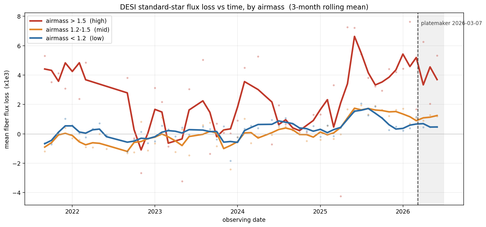
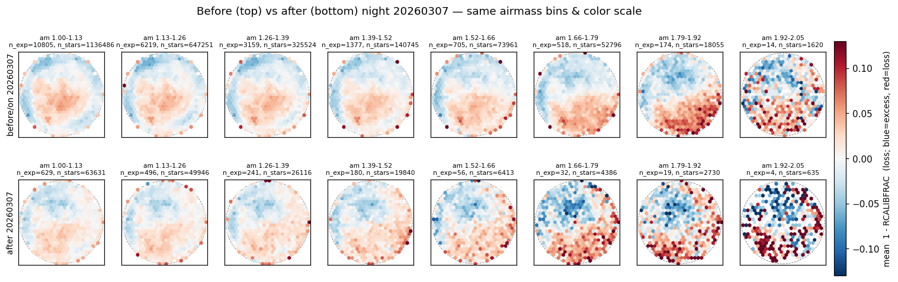
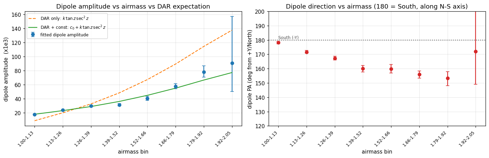
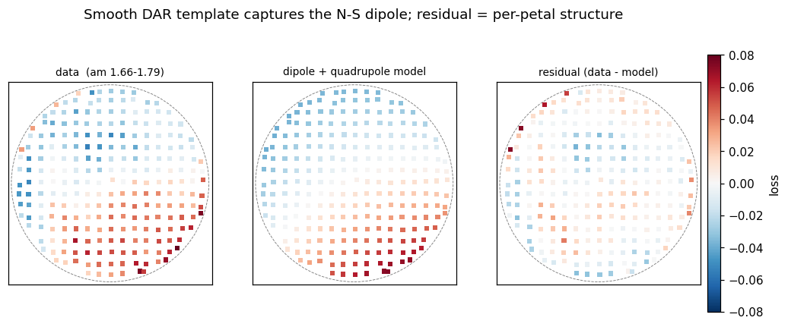
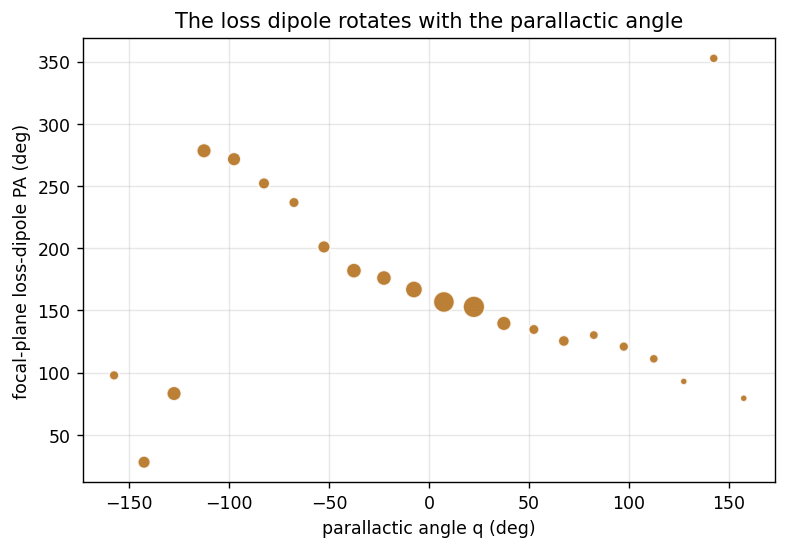
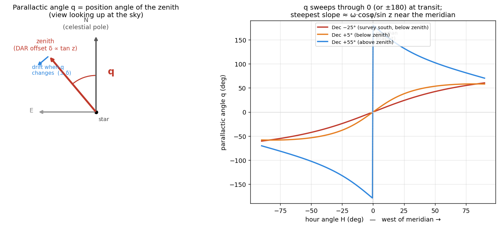
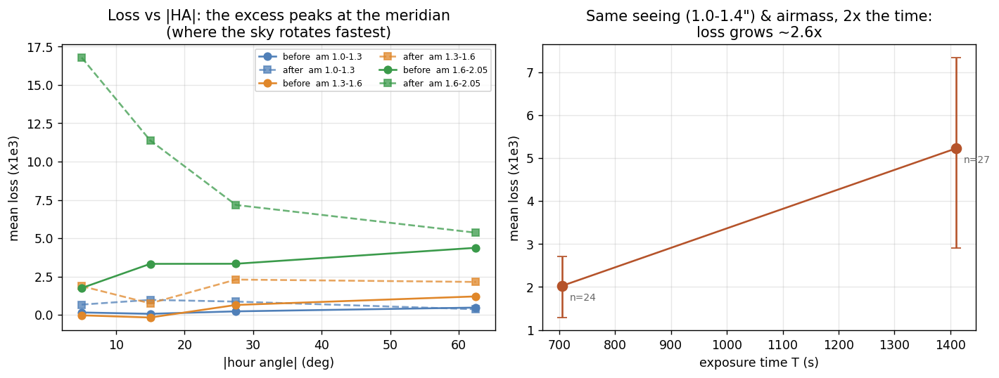

# Differential Atmospheric Refraction and Fiber Flux Loss at High Airmass

## Detection, Mechanism, and Observing-Strategy Implications

K. Honscheid (OSU) with Claude (Anthropic) · consolidated 2026-07-23

> Consolidated report combining the DAR fiber-loss investigation (started 2026-07-20/21, NERSC
> access-window constrained) with the pointing/timing follow-up performed off-site during the NERSC
> outage. From the pooled `calibstars` standard-star dataset plus a per-exposure pointing/timing
> table joined from the KPNO exposure database. Figures reproduce from
> `notebooks/dar_fiber_loss_reproduction.ipynb` and `notebooks/dar_pointing_tests.ipynb`. Companion
> to `FIELD_ROTATION_REPORT.md`. The earlier standalone drafts are archived under `archive/`.

---

## Executive summary — two findings

Much of the remaining DESI schedule targets southern fields (Dec −10° to −30°) at sustained high
airmass. Investigating what limits standard-star fiber flux there turned up **two distinct results**:

**Finding 1 — a flux-loss *calibration* shift turned on around mid-2025, and nobody had flagged it.**
Standard-star loss (`loss = 1 − RCALIBFRAC`) stepped up around mid-2025 across *all* airmass —
including low airmass, where DAR is negligible — so it reflects a change in the **flux-loss
calibration / measurement itself**, not in positioning or the atmosphere. A three-epoch split shows
it is **not** the March-2026 PlateMaker change (loss is unchanged across that date at every airmass).
We flag the shift to the Data Systems team and **do not diagnose its origin here** — it need not be an
offline-pipeline change; a genuine instrument or software effect would look the same. This was
detected in the course of the DAR work; it had not been noticed before.

**Finding 2 — the steep growth of loss with airmass is *residual* DAR acting during the exposure.**
DESI has a working, airmass-driven ADC that removes the *bulk* atmospheric dispersion; what remains
is a **residual** DAR effect that accumulates over the exposure and grows with airmass. Using new
per-exposure pointing we show the residual loss forms a focal-plane dipole that **rotates with the
parallactic angle** — a direct geometric confirmation of DAR — driven near the meridian by the
*rotation* of the refraction offset (not the change in its magnitude). It scales with the rotation
drift `tan z·dq/dt·T`, is **largely irreducible by positioning**, and is **invisible to the short
dither sequences** used to validate positioning. It sets a physical limit on high-airmass fiber
throughput with concrete observing-strategy consequences — most importantly that **proximity to
transit**, not Dec or airmass alone, is the dominant lever, and that the ADC's hard **ZD = 60°
(airmass 2.0)** limit means Dec ≤ −28° fields run their *entire* observation in an under-corrected
regime.

The two findings are independent: Finding 1 is *why the loss level moved* (a calibration question we
hand off); Finding 2 is *why loss climbs with airmass in every epoch* (a physics result with
scheduling implications). The report is organized as **Part I — the detection**, **Part II — the DAR
mechanism**, **Part III — observing-strategy implications**, with the detailed investigation history
in the appendices.

**Data.** The pooled `calibstars` dataset: one row per VALID standard-star measurement across every
DESI DARK/BRIGHT/DARK1B/BRIGHT1B science exposure (corrected complete population n = 15,206 exposures,
1,614,728 star-measurements; the earlier population was n = 12,043 / 1.27 M — see Appendix A), with
focal-plane X/Y, `RCALIBFRAC`, `loss`, `airmass`, `seeing`, `night`. Joined to a per-exposure
pointing/timing table from the exposure database (RA/Dec, hour angle, parallactic angle, zenith
distance, exposure time, ADC prism angles, hexapod rotator rate), validated internally to sub-degree.
Convention throughout: **red = flux loss, blue = excess**; focal plane **+Y = North**, fixed to the
sky by the equatorial mount.

---

# Part I — The detection: a mid-2025 flux-loss calibration shift

## 1. When did the loss change?

The question that started the pointing follow-up was a two-epoch before/after split at the PlateMaker
date, which showed higher "after" loss. Before reading anything physical into that, we asked simply
**when** the loss changed. Mean loss vs time, split by airmass:

Three things read off it directly:

1. **The rise is airmass-graded** — high (>1.5) ≫ mid (1.2–1.5) > low (<1.2) — not confined to one bin.
2. **Even low airmass lifts off its flat pre-2025 baseline.** A pure DAR / observing effect would
   leave the low-airmass curve flat; instead it rises too, so there is a genuine **systematic
   component** underneath, present where DAR is negligible.
3. **There is no step at the PlateMaker line** (dashed, 2026-03-07). The climb is well underway
   *before* that date.

To sharpen it, split into three epochs and compare mean loss vs airmass directly. Epoch **A** is
before 2025-03 (the flat baseline); **B** runs 2025-03 to the 2026-03-07 PlateMaker change; **C** is
after (July 2026 excluded — that month's on-sky time was weather-limited and non-representative).

| airmass | A (<2025-03) | B (2025-03→2026-03) | C (>2026-03) |
|---|---|---|---|
| **1.0–1.2** (low, DAR-free → isolates the systematic) | 0.12 [0.08, 0.15] | 0.70 [0.64, 0.76] | 0.67 [0.57, 0.76] |
| **1.5–2.05** (high, where a PlateMaker effect would live) | 0.97 [0.74, 1.16] | 4.11 [3.83, 4.39] | 3.89 [3.12, 4.59] |

(mean loss ×10⁻³, with bootstrap-over-exposures 16–84% intervals.)

## 2. It is calibration-level — not the PlateMaker, not purely DAR

- **A → B is a large, significant jump at *both* airmasses** (low 0.12 → 0.70, ~6×; high 0.97 →
  4.11, ~4×; the intervals are nowhere near overlapping). This is the mid-2025 systematic.
- **B → C is null.** Low airmass 0.70 vs 0.67, high airmass 4.11 vs 3.89 — statistically identical,
  intervals fully overlapping. In the figure, the B and C curves lie essentially on top of each
  other across the whole airmass range. **The PlateMaker change added nothing at any airmass.**
- **The low-airmass jump is the key.** Where DAR is negligible, positioning and atmosphere cannot
  produce a loss; yet the loss still rose A → B. That isolates a **calibration- / measurement-level**
  change — something in how `RCALIBFRAC` is produced changed around mid-2025.

**What we conclude, and what we deliberately do not.** Something in the flux-loss calibration changed
around mid-2025. We flag this to the Data Systems team and **do not attempt to diagnose its origin**:
it need not be a change in the offline pipeline — a genuine instrument or software effect would
produce the same signature. What the three-epoch split *does* establish is negative and positive at
once: the increase **is not** the PlateMaker (B ≈ C), and **is not** purely DAR (it appears even at
low airmass). The original before/after "excess" was an artifact of a two-epoch split straddling this
mid-2025 transition — the "before" bin blended the flat A period with the risen B period, so "after"
(= C) looked elevated relative to that blend. Split at the *actual* transition and the PlateMaker step
vanishes. (The March-2026 change did add a second-order refraction term to positioning; it is
dither-validated to *improve* instantaneous accuracy and is discussed only where relevant in Part III.)

That settles *when* and *whether-the-code*. The rest of the report addresses the second, independent
question — **why the loss grows with airmass in every epoch** — which is residual DAR.

---

# Part II — The mechanism: residual DAR during the exposure

## 3. The setup: DESI's ADC removes the bulk, so we are measuring the residual

Before interpreting any high-airmass loss as "DAR," note that DESI actively corrects DAR. The
exposure record carries `adc_angle1`/`adc_angle2` (deg) and `adc_status1`/`adc_status2` for the
two-element atmospheric dispersion corrector, and the data show it is real, active, and airmass-driven
(n = 12,043 sample):

- **Prism separation angle** `|adc_angle1 − adc_angle2|` (circular-wrapped) correlates with airmass at
  **ρ = 0.996** — rising smoothly from ~12.5° near zenith to ~116° at the highest airmasses. This is
  the textbook signature of a counter-rotating dual-prism ADC: separation sets the *amount* of
  achromatic dispersion correction, which must grow with airmass.
- **The prisms are `STOPPED` (fixed) for the whole exposure** — both `adc_status` = `STOPPED` for
  100% of exposures, and there is **no `adc_rate` field anywhere in the schema** (unlike the corrector
  rotator, which *is* continuously driven via `hexapod['rot_rate']`). The ADC is set once and held.

**Two consequences frame everything below.** (i) Because the ADC is fixed with no tracking, once set
it cannot adapt to airmass continuing to change during the exposure — giving a specific physical
mechanism for the intra-exposure, time-accumulating residual we characterize. (ii) The bulk,
achromatic, zenith-aligned DAR shift is *already removed*, so the residual we see is smaller and need
not reproduce the naive "uncorrected DAR" shape — an important caution for reading the spatial
patterns in §6.

*Caveat:* the working assumption "ADC angle is set near exposure start and held fixed" is a strong
circumstantial case (100% `STOPPED`, no rate field, tight airmass correlation) but not independently
validated for *when* the angle is set, the way the airmass snapshot was (Appendix A). Treat it as the
leading hypothesis.

## 4. The residual loss pattern is DAR

Binned by airmass, the focal-plane loss shows a coherent **North–South dipole** — blue North, red
South — strengthening steeply with airmass (before top, after bottom):

**(a) It matches the equatorial-mount prediction.** Because the focal plane is fixed to the sky, DAR
lies along the parallactic angle in a fixed focal-plane frame. The geometry predicts a **dipole (a
tilt across the field)** with amplitude scaling as **`tan z·sec²z`** along the **N–S** axis (southern
fields have their zenith toward +Y near transit). Fitting the loss tilt per airmass bin confirms both:

A smooth dipole+quadrupole template captures most of the spatial structure, leaving the discrete
per-petal calibration pattern as the residual:

**(b) The dipole rotates with the parallactic angle** — the decisive test, enabled by the new pointing
data. The loss is a *tilt* across the focal plane, a gradient vector `g = (g_x, g_y)` (with the
per-exposure mean removed, a tilt reads as one side red, the opposite blue — the two-lobe look). If
it is DAR its direction must track the parallactic angle `q`; an instrumental tilt would stay fixed.
Binning exposures by `q`, the dipole's focal-plane direction **rotates with `q`**:

Fitting the tilt as a fixed part plus a part that rotates with `q` (`loss ≈ a·x+b·y + c·Re(w)+d·Im(w)`,
`w = e^{−i·s·q}(x+iy)`): a rotating tilt explains more than a fixed one at equal parameter count
(R² ≈ 0.130 for s=+1 vs 0.111 fixed; chirality resolved), and in the combined fit the **rotating (DAR)
amplitude exceeds the fixed (instrumental) one at ~4.7σ** (|G| ≈ 36 vs |g_fix| ≈ 29 ×10⁻³, bootstrap
over exposures), carrying **~60% of the dipole variance**. So the dipole is a mix: a dominant DAR tilt
that rotates with the sky, plus a smaller fixed instrumental tilt. This confirms the DAR origin
geometrically, independent of the amplitude-scaling argument.

## 5. The physics: near the meridian it is the *rotation*, not the airmass change

Assume the fiber is positioned perfectly at any instant; the residual loss then comes from how the
DAR offset **changes** while the telescope tracks. Definitions: **position angle** = direction from
North toward East; **parallactic angle q** = the position angle of the zenith at the star (refraction
pushes light toward the zenith, so the offset points at PA = q); **ω** = Earth's sidereal rate; **φ**
= latitude; **z** = zenith distance; **H** = hour angle.

The offset has magnitude ∝ `tan z`, points at PA = q, and changes two ways as the Earth turns:

- **magnitude** (offset lengthens): rate ∝ `sec²z·(dz/dt)`, and `dz/dt ∝ sin H` → **zero at the
  meridian** (airmass at a parabolic minimum);
- **direction** (offset rotates): rate ∝ `tan z·(dq/dt)`, and `dq/dt = ω·cosφ/sin z` at transit →
  **first-order and near-maximal at the meridian**. Rotating a vector of length L by dθ moves its tip
  by L·dθ *perpendicular* to itself, so `tan z` is the lever arm and the drift is sideways.

So **near the meridian — where DESI observes — the magnitude is frozen and the change is dominated by
the parallactic-angle rotation**, with drift rate

  `tan z·dq/dt = ω·cosφ·sec z`,

present right at transit and growing with `sec z` — and **sec z = airmass**, so the effect scales with
airmass. Distinctive prediction: the residual loss should be *present at the meridian* and grow with
airmass — the opposite of an off-meridian magnitude-drift effect.

**Two channels, one cause.** The same parallactic rotation appears as (i) the **DAR-dispersion drift**
— the dispersed image translating within the fiber, which nothing corrects — and (ii) a small **field
rotation** the hexapod actively compensates (`rot_rate` tracks `−dq/dt` near the meridian), leaving
only the residual quantified in `FIELD_ROTATION_REPORT.md`. Testing whether the hexapod term adds to
the loss beyond `tan z·Δq` returns nothing independent, consistent with (ii) being compensated and
subdominant. Channel (i) is the driver.

## 6. Reconciling the two spatial views: isotropic monopole vs. rotating dipole

An earlier pass at this data (before the pointing join) decomposed the loss by **distance from field
center** and found something that looked, at first, like the opposite of DAR — worth stating plainly
because the two views must be reconciled.

- **The radial (monopole) gradient is large and *isotropic*, and it flattens with airmass.** A per-star
  regression `RCALIBFRAC ~ radius × airmass` gives a huge, unambiguous interaction (R² = 0.132,
  interaction p = 2.2e-168, n = 1.61 M, cluster-robust by exposure), but the edge-vs-center flux ratio
  span *shrinks* with airmass (≈ +0.060 at low airmass → +0.036 at high), the opposite of naive
  "DAR worsens at the edge." A validated zenith-direction decomposition (using `desimeter`'s own tested
  `radec2tan`/`tan2fp` transforms, checked against the DB `parallactic` column to std 0.003°) shows
  this radial pattern is **isotropic**: the signed along-zenith term explains almost nothing on its own
  (R² = 0.0007 vs 0.132), and splitting the outer radius into zenith-facing vs anti-zenith halves at
  matched radius/airmass shows only a tiny, non-monotonic difference.

- **The dipole, once isolated, *is* directional DAR — and it turns on at high airmass.** The along-
  zenith (dipole) signal is sharply threshold-like: slope ≈ 0 (p = 0.89) for airmass < 1.4, rising to
  clearly positive (p = 0.005, raw corr 0.116) for **airmass ≥ 1.8**, right at the ADC's ZD = 60°
  limit; the two most extreme individual exposures (airmass 2.28–2.33) show along-zenith correlations
  of 0.22 and 0.50 on their own.

These are **different multipoles of the same maps, and they agree.** The isotropic *radial monopole*
(mean flux vs distance from center) is dominated by a static field pattern plus **seeing** (§8), with
the ADC having already removed the bulk directional DAR — so there is little directional signal left
in the population average. The *dipole* (mean-removed tilt) is the **residual directional DAR**, small
at typical airmass and growing to clearly detectable near the ADC's limit. The new pointing data (§4)
is exactly this dipole seen with the parallactic angle attached: the fiber-loss decomposition inferred
"directional DAR turns on at airmass ≥ 1.8," and Test A confirms it directly — the dipole *rotates with
q*. No contradiction; the pointing join sharpened a threshold the radial view had already found.

## 7. The residual accumulates over the exposure — two faces

That the effect is *intra-exposure* (accumulating with time, not a fixed high-airmass throughput
offset) is the key discriminator for real DAR drift, and it shows up in two complementary observables.

**(a) Mean loss — the rotation-drift channel, strongest near transit.** With pointing/timing we test
the drift `tan z·dq/dt·T` factor by factor:

- **`dq/dt` — loss peaks at the meridian** (left). At high airmass the loss is largest at low |HA| and
  falls toward high |HA|, exactly where `dq/dt` is largest then declines. A magnitude/ZD drift would do
  the opposite (grow off-meridian), ruling that alternative out.
- **`T` — loss grows with exposure time** (right). Holding seeing (1.0–1.4″) and airmass (~1.48, near
  the meridian) fixed, doubling the exposure time raises the loss ~2.6× (2.0 → 5.2 ×10⁻³). The
  exposure-time spread is driven mainly by transparency (normalized out of `RCALIBFRAC`, and not
  affecting seeing), so at fixed seeing and airmass this is near-controlled — the effect is genuinely
  *time-integrated*.

**(b) Within-exposure scatter — the magnitude-change / ADC-mismatch channel, strongest off transit.**
Regressing the star-to-star scatter within each exposure, `std_rcalibfrac ~ airmass + exptime`, the
airmass×exptime interaction is real and much stronger than for the mean (F = 169, p = 2.2e-38). But the
right metric is not snapshot airmass — it is how much airmass actually *changes* during the exposure,
`|Δairmass|`: substituting it nearly doubles the explanatory power (R² 0.096 → 0.144; → **0.204** on the
complete population) and the coefficient is +0.149 (more airmass change → more disagreement between
stars in the same exposure). This is the fixed-ADC mismatch: its one-shot correction increasingly
misses as airmass evolves, smearing the flux distribution without necessarily shifting its mean.

**The two faces are one residual, split by hour angle.** Near transit the airmass magnitude is frozen
(`|Δairmass|` → 0) but `dq/dt` is maximal, so the **rotation** channel dominates and shows up as the
mean-loss dipole (a). Off transit `dq/dt` falls but `|Δairmass|` grows (a field at fixed current
airmass accumulates `|Δairmass|` ~30× faster 32° off transit than at transit — §10), so the
**magnitude-change / ADC-mismatch** channel takes over and shows up as within-exposure scatter (b).
Both are residual DAR left after a fixed ADC, both accumulate with exposure time, both grow with
airmass — seen in different observables because they act in different parts of the track.

*One caveat on the spatial side:* the radial×airmass gradient itself does **not** robustly depend on
exposure time (3-way `radius:airmass:exptime` interaction p = 0.105 after cluster-robust correction).
The time dependence is firmly established in the *aggregate* (mean and scatter) channels; the static
radial monopole is governed by absolute airmass level (fiber positions assigned once near the start),
while airmass *change* governs the scatter — two distinct symptoms.

## 8. Seeing drives the isotropic radial pattern

The zenith-direction decomposition ruled out a coherent DAR shift as the cause of the isotropic
radial×airmass pattern (§6), leaving the mechanism open. The most physically plausible alternative —
airmass-driven seeing/PSF-size degradation interacting with a radially-varying fiber-coupling pattern —
is directly testable, since `seeing` is a complete per-exposure DB scalar only weakly correlated with
airmass (ρ = 0.098, so genuinely separable).

`radius × seeing` alone **reproduces the same isotropic "flattening" signature and explains slightly
*more*** than `radius × airmass` (R² = 0.140 vs 0.132, identical negative-interaction sign). Combining
both, **each retains an independent, highly significant contribution** (airmass coefficient shrinks
only modestly, −0.0226 → −0.0195, still p = 3e-136; seeing's is comparable, −0.0190), combined
R² = 0.145; survives region/season controls. So the isotropic pattern is driven largely by
**seeing/PSF broadening** — a general (non-directional) atmospheric effect, which is exactly why it
does *not* align with the zenith direction the way DAR would — interacting with some radially-varying
sensitivity in fiber coupling or throughput not yet localized (untested candidates: fiber positioner
accuracy vs radius, spectrograph vignetting vs radius).

*Operational note:* unlike airmass and `|Δairmass|` (deterministic from Dec/HA/exptime), seeing has a
stochastic weather-driven component not fixed by pointing — so a smarter exposure-time decision could
in principle use live seeing alongside the geometry of Part III.

---

# Part III — Observing-strategy implications

## 9. The rotation drift is largely irreducible, and invisible to dither validation

**Irreducible by positioning.** Worked example — Dec −25°, a 20-min exposure starting at HA = 5°
(airmass ~1.85), fiber 300 mm from center:

| quantity | value |
|---|---|
| target drift over the exposure (parallactic rotation ~5°) | **~28 μm** |
| residual RMS offset even with perfect *midpoint* positioning | ~8 μm |
| midpoint position − *integrated-loss-optimal* position | ~0.1 μm |

The exposure midpoint already coincides with the integrated-loss optimum to ~0.1 μm, so "optimize the
fiber for integrated loss instead of the midpoint" gains essentially nothing. Positioning accuracy is
not the lever.

**Invisible to dither validation.** Positioning is validated with fiber dithering (Schlafly et al.
2024, arXiv:2403.05688): short (3-min) exposures repositioned between each — an *instantaneous* metric.
Over 3 minutes with repositioning, essentially no rotation drift accumulates, so the dithers cannot see
this effect by construction. (The March-2026 second-order refraction term improves that instantaneous
metric — a real, correct improvement — but does not bound the intra-exposure drift; the two should be
tracked separately.)

## 10. Proximity to transit is the dominant lever — off-meridian does not help

Since the mean-loss (rotation) channel peaks at the meridian, one might hope to observe a *given*
low-Dec field off the meridian, trading higher airmass for lower `dq/dt`. **It does the opposite.**
For a *fixed* field the drift is minimized at transit and grows off-meridian: as the field leaves the
meridian `dq/dt` falls but `tan z` rises (their product stays roughly flat) *and* the previously-zero
magnitude drift switches on, so the total only increases. A 20-min exposure at Dec −25° drifts ~26 μm
at transit, ~35 μm at HA = 1 h, ~75 μm at 2 h (Dec −40° runs ~70 μm to several hundred). **Transit is
already the optimal hour angle for any field** — the drift cannot be scheduled away, only shortened.

The scatter (magnitude-change) channel says the same thing from the other side: at matched *current*
airmass, an off-transit field accumulates `|Δairmass|` far faster:

| Dec | HA to reach airmass ≈ 1.62 | airmass 10 min later |
|---|---|---|
| −5° | 38.3° off transit | 1.62 → 1.68 (Δ = +0.064) |
| −20° | 0° (at transit) | 1.62 → 1.62 (Δ = +0.002) |

— a ~30× difference. So a deep-south field observed *near transit* can be genuinely safer than a
moderate-Dec field observed well off transit, despite higher raw airmass. **The answer to "does it
depend only on airmass?" is no — proximity to transit matters as much as or more than Dec, and this
piece follows from exact spherical geometry, not a fitted model.**

**Symmetric-window crossing table.** DESI plans exposures straddling HA = 0 symmetrically; the relevant
metric is then the airmass *excursion* `max − min` over the window, not a signed difference (which is
≈0 by symmetry). Empirical scatter increase vs window half-width (baseline scatter 0.0422):

| Dec | transit airmass | ±2° (≈16 min) | ±4° (≈32 min) | ±6° (≈48 min) | ±8° (≈64 min) |
|---|---|---|---|---|---|
| −5° | 1.25 | +1% | +1% | +1% | +3% |
| −10° | 1.35 | +1% | +1% | +1% | +3% |
| −15° | 1.47 | +7% | +7% | +7% | +7% |
| −20° | 1.62 | +12% | +12% | +7% | +13% |
| −22° | 1.70 | +12% | +12% | — | — |
| −24° | 1.79 | +12% | +12% | too little data | too little data |
| **−25° and south** | 1.83+ | **no data at any window width** | | | |

Two findings: within the well-sampled range (Dec ≥ −22°) the *excursion* channel alone stays modest
(+1–13% even for a generous ±8° window), so window width by itself isn't a strong constraint there; but
there is a **hard data wall at Dec ≈ −24°/−25°** — the southern DARK/BRIGHT program is only just
beginning (Appendix A).

## 11. The ADC ZD = 60° wall constrains the southern program

The ADC has a hard operating limit at **ZD = 60° (airmass 2.0)**, confirmed in the data: only 3/12,043
exposures (0.02%) exceed it, and those show a **saturated, flat** prism-separation angle (178.70° ±
0.0007°) rather than continued growth — a real mechanical/design stop. At KPNO's latitude (31.9633°N)
the best-case airmass for a field is `sec(|lat − Dec|)` at transit:

| Dec | ZD at transit | airmass at transit (best case) |
|---|---|---|
| −10° | 41.96° | 1.35 |
| −15° | 46.96° | 1.47 |
| −20° | 51.96° | 1.62 |
| −25° | 56.96° | 1.83 |
| **−28°** | **59.96°** | **2.00 — the ADC's limit, at transit** |
| −30° | 61.96° | 2.13 |
| −35° | 66.96° | 2.56 |

**Dec ≈ −28° is the critical threshold.** Fields at Dec ≥ −25° stay within the ADC's corrected range
for the best part of their track. Fields at **Dec ≤ −28° never drop below ZD = 60°, even at transit** —
their *entire* observation runs where the ADC cannot fully correct, so the loss there should be treated
as substantially **uncorrected** DAR (a qualitatively larger effect than the mostly-corrected residual
this sample, 99.98% within the ADC's range, characterizes), and this is exactly the regime where the
directional dipole (§6) turns on. Quantifying it directly needs a targeted Dec ≤ −28° sample, which
does not exist yet (Appendix A).

**Operational lookup (empirical, non-extrapolated).** Rather than trust a linear extrapolation into the
sparsely-sampled high-airmass corner (which produced physically backwards predictions and was
discarded), the binned lookup reports only what was observed:

| airmass_start | \|Δairmass\| | mean `std_rcalibfrac` | n |
|---|---|---|---|
| 1.0–1.2 | 0–0.01 | 0.044 | 4,194 |
| 1.4–1.6 | 0–0.01 | 0.047 | 90 |
| 1.4–1.6 | 0.1–0.5 | 0.061 | 48 |
| 1.6–1.8 | 0.1–0.5 | 0.065 | 86 |
| **1.8–2.0** | **0.1–0.5** | **0.081** | **45** |
| 2.0–2.4 | 0.1–0.5 | 0.288 | 2 (too few to trust) |

At fixed airmass, scatter rises monotonically with `|Δairmass|`; at fixed `|Δairmass|`, with airmass.
The best-populated near-limit cell (airmass 1.8–2.0, large `|Δairmass|`, n = 45) shows **~2× the
low-airmass baseline** on real data.

## 12. What to do with this

- **Schedule long/southern exposures to straddle transit as tightly as feasible** — the single most
  effective lever, more so than Dec itself, and grounded in exact geometry (§10).
- **Cap exposure duration at high airmass** — the drift accumulates ∝ T, so shorter or split exposures
  reduce it; the ~1–2% flux loss is the quantity to weigh against the ~2-min-per-restart overhead. This
  report characterizes the effect; the cost/benefit needs the science-value of a given scatter increase,
  which is out of scope here.
- **Treat Dec ≤ −28° as an under-corrected regime**, not a residual one, and revisit with a targeted
  sample once the southern survey accumulates.
- **Track instantaneous-positioning metrics and intra-exposure loss separately** — dither validation
  does not bound the latter.
- **Do not rely on positioning to fix the rotation drift** — the midpoint is already the integrated-loss
  optimum to ~0.1 μm.

---

## Conclusion

Two independent things are going on in the standard-star loss. First, the **increase** everyone would
have noticed is a **calibration-level shift that turned on around mid-2025** — present even at low
airmass where DAR is negligible, and **not** caused by the March-2026 PlateMaker change (loss is
unchanged across it at every airmass). Its origin is a calibration/measurement question we hand to Data
Systems. Second, the **airmass dependence** of the loss, in every epoch, is **residual DAR acting during
the exposure** — what remains after DESI's fixed, airmass-driven ADC removes the bulk. It appears as a
focal-plane dipole that rotates with the parallactic angle (a direct DAR confirmation), driven near the
meridian by the *rotation* of the refraction offset and off the meridian by the *magnitude change* the
fixed ADC cannot track; it scales with `tan z·dq/dt·T`, is largely irreducible by positioning, and is
invisible to short dither sequences. Operationally, **proximity to transit is the dominant lever**, and
the ADC's **ZD = 60° limit** makes Dec ≤ −28° a qualitatively harder regime. It is a distinct, physical
limit on high-airmass fiber throughput — separate from the mid-2025 calibration shift, and separate from
instantaneous positioning accuracy.

---

## Appendix A — Investigation history and corrections

This consolidates the corrections and confound checks made during the investigation; every core
conclusion survives them.

- **Snapshot airmass was the wrong metric for the scatter channel.** Stage 1 originally used the single
  `tcs.airmass` snapshot; replacing it with a time-resolved `|Δairmass|` (computed from `HA(t) =
  mount_ha + sidereal_rate·t`, Dec fixed, KPNO latitude) nearly doubled the scatter R² (0.096 → 0.144)
  and sharpened significance (p 2.2e-38 → 3.2e-180). The recorded airmass was confirmed to be a
  *start-of-exposure* snapshot (matches computed start to 0.0006, vs 0.02–0.14 for end/mid-average),
  validating `mount_ha` as the t = 0 reference. The spatial "flattens, not steepens" direction is
  unchanged by this correction (it is governed by absolute airmass level, not airmass change).

- **Population undercount — 22%, caught by the user.** The program filter used exact-match `LIKE`
  (`'DARK'`/`'BRIGHT'`), silently excluding `DARK1B` (n = 1,859) and `BRIGHT1B` (n = 1,537) —
  together 22% of the true population. Re-ran every core test on the complete population
  (n = 15,206 exposures, 1.61 M stars): every finding survives, the Stage 1 scatter result is if
  anything stronger (R² 0.144 → 0.204), the Stage 2 interaction remains p = 2.2e-168 with the same
  sign, and the ADC correlation is unchanged (ρ = 0.9958). Numbers elsewhere reflect the original
  12,043-exposure population unless marked complete/corrected; the qualitative story is unchanged.

- **Region/season confound — checked, survives.** Adding an empirical NGC/SGC region split and a
  cyclical season term (`sin`/`cos` of day-of-year) to both the aggregate and per-star models: both are
  detectable (huge n) but the key coefficients barely move (`|Δairmass|:exptime` +0.0112 → +0.0101,
  still p < 1e-33; `radius:airmass` −0.0226 → −0.0226, still p ~ 2e-168). Not a confound in either
  test — unlike the region effect in `FIELD_ROTATION_REPORT.md`.

- **Extrapolation discarded twice.** Coefficient-based linear predictions into the high-airmass corner
  (only ~2.8% of the sample has airmass > 1.7) produced physically backwards results (scatter
  *decreasing* with exposure time). Discarded in favor of empirical binned lookups both times — the
  same discipline applied throughout.

- **Dec ≤ −28° follow-up — confirmed not yet possible.** At science quality there are currently **zero**
  qualifying exposures at Dec ≤ −28° and only 6 at Dec ≤ −25° (all from the last two weeks of the
  archive). The southern DARK/BRIGHT program is only just beginning; the targeted low-Dec follow-up
  flagged throughout should be revisited as the survey accumulates.

- **Still genuinely open.** What radially-varying sensitivity seeing/PSF-size interacts with (fiber
  positioner accuracy vs radius? spectrograph vignetting vs radius?); the separate chromatic DAR
  *smearing/elongation* possibility (as opposed to translation) that the linear along-zenith test would
  not detect; and, of course, the origin of the Finding 1 calibration shift (→ Data Systems).

## Appendix B — Status of each finding

| Status | Finding |
|---|---|
| ✅ | Finding 1: a flux-loss calibration shift (visible even at DAR-free low airmass) turned on ~mid-2025; three-epoch split shows it is **not** the 2026-03-07 PlateMaker change (B ≈ C at all airmass). Origin handed to Data Systems, not diagnosed here. |
| ✅ | Mean-flux airmass×exptime interaction real (F = 23.8, p = 1.1e-6) but small (~1% at the extreme observed range). |
| ✅ | Within-exposure scatter airmass×exptime interaction real and much stronger (F = 169, p = 2.2e-38); `|Δairmass|` is the right metric (R² 0.096 → 0.144 → 0.204 complete population). |
| ✅ | Radial × airmass interaction huge and unambiguous (R² → 0.132 complete population, n = 1.61 M, cluster-robust) but *flattens, not steepens* — an isotropic monopole, not a directional shift. |
| ✅ | DESI has a working, airmass-driven two-element ADC (prism separation vs airmass ρ = 0.996), `STOPPED`/fixed for the exposure with no rate field — so this study measures *residual* DAR; the fixed correction increasingly mismatches as airmass changes (the `|Δairmass|` mechanism). ADC angle *timing* not independently validated. |
| ✅ | ADC hard limit ZD = 60°/airmass 2.0 real in the data (3/12,043 exceed it, saturated angle). Dec ≤ −28° never drops below it even at transit → under-corrected regime for the far-southern program. |
| ✅ | Zenith-direction decomposition (using `desimeter`'s own validated transforms) shows the radial×airmass effect is **isotropic** on population average (directional R² 0.0007 vs 0.132) — but a real, threshold-like directional signal turns on at **airmass ≥ 1.8** (p = 0.005), near the ADC limit. |
| ✅ | New pointing data confirms the directional residual directly: the mean-removed loss **dipole rotates with the parallactic angle** (Test A), rotating (DAR) amplitude > fixed (instrumental) at ~4.7σ, ~60% of dipole variance. The same threshold-onset DAR the radial view inferred, now geometric. |
| ✅ | Loss scales with the rotation drift `tan z·dq/dt·T` (Test B): peaks at the meridian (dq/dt), grows ~2.6× for 2× exposure time at fixed seeing/airmass. |
| ✅ | Proximity to transit — not Dec or airmass alone — is the dominant lever (exact geometry: `|Δairmass|` grows ~30× faster 32° off transit). Off-meridian scheduling does **not** help; transit is optimal. Symmetric-window excursion table modest within Dec ≥ −22°, hard data wall at Dec ≈ −24°/−25°. |
| ✅ | DAR rotation drift is largely irreducible by positioning (~28 μm drift, ~8 μm residual at perfect midpoint, midpoint = integrated-loss optimum to ~0.1 μm) and invisible to short dither sequences. |
| ✅ | Seeing (ρ = 0.098 with airmass, separable) substantially explains the isotropic radial pattern (`radius×seeing` R² 0.140 > `radius×airmass` 0.132; both independent when combined). |
| ✅ | Region/season confound checked (Stage 1 and Stage 2) — key coefficients essentially unchanged. |
| ⬜ | Targeted Dec ≤ −28° sample — confirmed not yet possible (0 qualifying science exposures); revisit as the survey accumulates. |
| ⬜ | Origin of the mid-2025 calibration shift → Data Systems (not investigated here). |

## Appendix C — Methods

- **Notebooks.** Reproduction / DAR template: `notebooks/dar_fiber_loss_reproduction.ipynb`. Pointing
  tests, time-series & three-epoch split: `notebooks/dar_pointing_tests.ipynb`. Both self-contained from
  the local parquet + the pointing CSV; execute clean.
- **Epoch split (Finding 1).** A `night < 20250301`; B `20250301 ≤ night ≤ 20260307`; C `20260307 <
  night < 20260701` (July 2026 excluded, weather-limited). Per-airmass-bin means, bootstrap over
  exposures for the 16–84% intervals.
- **Dipole fit.** Weighted least squares of `loss ≈ g_x·x + g_y·y (+ quadratic)` on cell-mean maps; the
  fixed-vs-rotating separation fits `loss ≈ a·x+b·y + c·Re(w)+d·Im(w)`, `w = e^{−i·s·q}(x+iy)`.
- **Geometry.** sec z = airmass; parallactic angle `q = atan2(sinH, tanφ cosDec − sinDec cosH)`,
  φ = 31.9634°; drift `= tan z · Δq` with `Δq` the parallactic sweep over the exposure; airmass
  trajectory `HA(t) = mount_ha + sidereal_rate·t`, Dec fixed.
- **Zenith decomposition.** `desimeter.transform.radec2tan` / `tan2fp` with each exposure's actual
  `rot_offset` and ADC angles; validated against the DB `parallactic` column (std 0.003°).
- **Errors.** Bootstrap over **exposures** (stars within an exposure are correlated); per-star
  regressions use cluster-robust standard errors clustered by EXPID.
- **Data access.** Exposure list `data/dar_exposure_list.csv`; pointing/timing fetched via
  `scripts/fetch_exposure_pointing.py` → `data/dar_exposure_pointing.csv` (`exposure.exposure`, `DOS_DB_*`).
