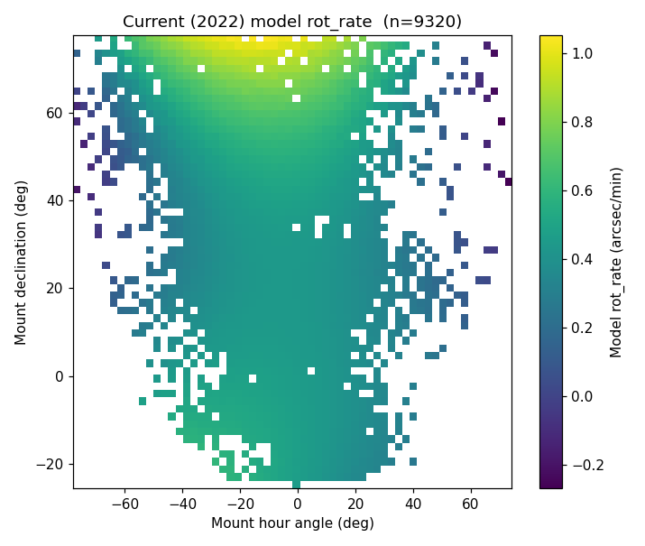
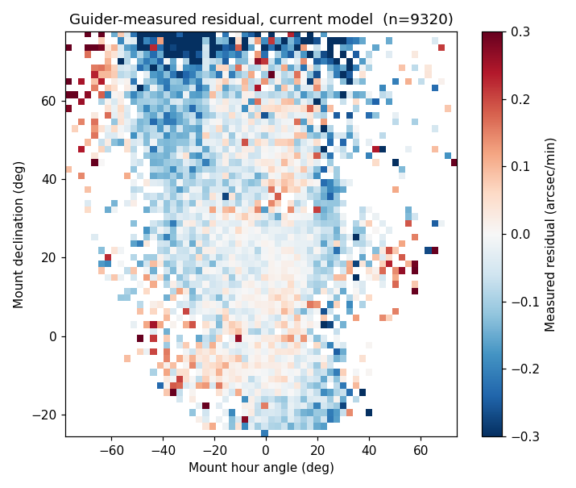
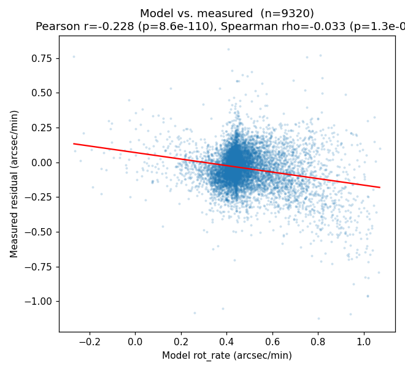
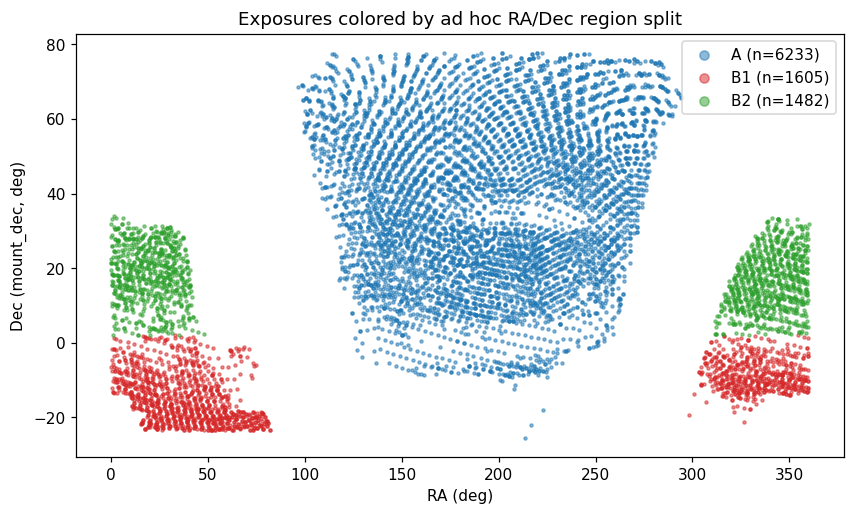
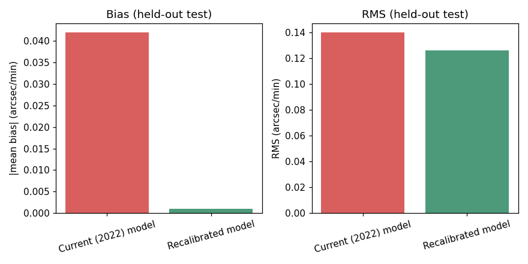
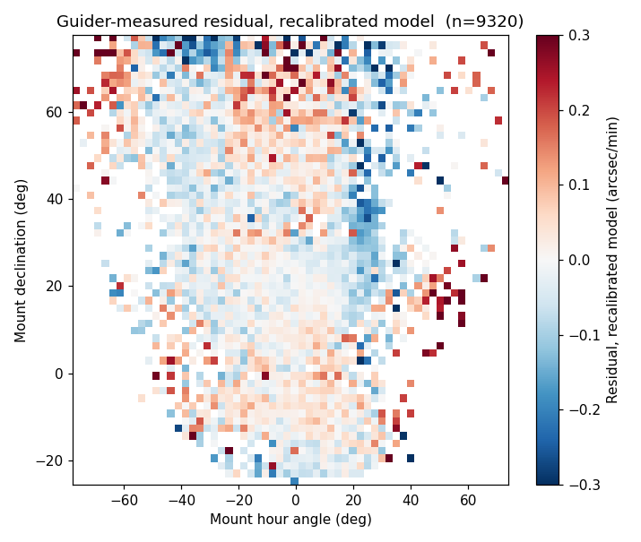

# Field Rotation Correction: Current Model, Measured Reality, and a Proposed Fix

**Status**: v3 — finalized for release (core rot_rate question concluded)
**Last updated**: 2026-07-23 (added forward-in-time validation split + deployable-function envelope; reconciled with the now-completed DAR follow-on study)
**Sample**: 9,320 exposures, 2023-01-18 to 2026-07-01
**Source notebooks**: `notebooks/fieldrotation.ipynb`, `notebooks/fieldrotationcorrection.ipynb`, `notebooks/fieldrotation_correlation.ipynb`
**Figures**: `notebooks/figures/*.png` (generated directly from `notebooks/merged_rot.csv`)

## Executive summary

The rotator-rate model that corrects for parallactic field rotation during DESI exposures is a cubic polynomial in mount pointing, last calibrated in September 2022. Comparing its predictions against what the guider actually measures, across 9,320 exposures spanning three and a half years, shows a real, statistically robust bias that grows with declination and is not explained by season, survey field, weather, insufficient update frequency, or (checked last) airmass beyond a marginal amount. Refitting the same functional form directly against current guider data — validated on data the fit never saw — cuts the bias to essentially zero and reduces scatter by about 10%. That ~10–12% improvement holds on both a random held-out split and a stricter forward-in-time (temporal) split, though the absolute go-forward scatter is higher than the headline (see Part 4).

**Recommendation: deploy the recalibrated static model; do not build a dynamic guider-based correction at this time.** Every candidate explanation tested for *why* a real-time correction would help — weather, TCS-correction magnitude, airmass — either came back weak, failed to replicate at full scale, or turned out to be better captured by a (marginal) static term. See the Conclusion section below for the full reasoning. A related but distinct question — whether differential atmospheric refraction at high airmass (relevant to upcoming southern-field observing) causes measurable fiber flux loss — was spun off as a separate study, now **completed** (`DAR_FIBER_LOSS_REPORT.md`); it does not involve `rot_rate` and should not be conflated with this conclusion, though it independently confirms the rotator correction is working (see the Conclusion's handoff note).

| Held-out metric (arcsec/min) | Current (2022) | Recalibrated (2026) |
|---|---|---|
| Bias — random split | -0.042 | **-0.001** |
| RMS — random split | 0.140 | **0.126** |
| RMS — temporal split (forward in time) | 0.171 | **0.150** |
| Exposures analyzed | | 9,320 |

---

## Part 1 — What the current model predicts — `Established`

DESI's alt-az mount introduces a field rotation that changes continuously with hour angle and declination. The online system corrects for this using `rot_rate`, computed by `desimeter.fieldmodel.dfieldrotdt()` and stored per-exposure in `hexapod['rot_rate']`. Reading the actual source (not assuming): this function deliberately ignores time (`mjd`) and calls only `dfieldrotdt_empirical_model` — a 9-term cubic polynomial in normalized hour angle and declination, fit once in September 2022 (credited to S. Kent) against archival guide-star data. A separate, exact-geometry `dfieldrotdt_physical_model` exists in the same codebase but is not the one actually used.



*Fig. 1 — Current (2022) model's predicted `rot_rate` across the sky actually observed, n=9,320. Rate ranges from near zero to just over 1 arcsec/min, strongly structured by declination.*

Two real gotchas surfaced while working with this: `exposure.exposure`'s flat `rotrate` column looks like the obvious source but is dead (one non-null value across 361,939 rows) — the live value lives in the `hexapod` jsonb blob instead. The model also has a hard ±1.5 arcsec/min saturation clip outside its fitted range; none of the exposures analyzed here hit it.

## Part 2 — What the guider actually sees — `Established`

If the model were perfect, the guider should measure a field rotation of zero, on average, once the correction is applied. To test this, we fit a straight line to each exposure's per-frame `rotation` estimate (`telemetry.guider_centroids`, roughly 100-200 frames per exposure at ~8s cadence) against the frame's own `obstime`. The fitted slope is the residual rotation rate left over after the model's correction — what we call the **measured** rate throughout. Sign convention: `measured = true_rate − model_rate`, so a positive value means the model *under-corrected* (the true rotation exceeded the applied rate); the true underlying rate is therefore recoverable as `model + measured` (used in Part 4).



*Fig. 2 — Guider-measured residual under the current model, same pointing grid as Fig. 1. Not flat, not centered on zero — real structure remains, most negative at high declination.*

**Noise floor**: a minimum of 40 guider frames is required per exposure before its slope is used — short of that, the fit is noise-dominated. Frame-level noise itself was checked directly: within-exposure fit residuals show real short-timescale autocorrelation (median lag-1 ρ=0.27), so naive fit-uncertainty estimates understate the truth by roughly 1.3x — but even corrected, per-exposure precision (~0.02-0.05 arcsec/min) stays well below the actual effect sizes reported below.

## Part 3 — Characterizing the discrepancy — `Established`

### The raw correlation is misleading on its own

A naive rank correlation between model rate and measured rate is weak at full scale (Spearman ρ=-0.033, n=9,320) — but the linear (Pearson) correlation is substantial (r=-0.228, p=9e-110). The relationship is real but non-monotonic enough to fool a rank-based statistic; this is exactly why this report leans on the regression/recalibration results below rather than a single correlation number.



*Fig. 3 — Model vs. measured, n=9,320. The fitted trend line is real (Pearson r=-0.228) even though the simple rank correlation undersells it.*

### It's (mostly) declination, modeled correctly

Nested regression tests were run properly — and corrected once when they weren't run properly enough. Against a naive *linear* HA+Dec model, both survey region (2 NGC patches + 1 SGC, confirmed empirically against a real DESI footprint scatter plot below) and a cyclical season term looked like independent, significant effects (region: F=95.0, p=1.4e-41). Once the baseline was upgraded to the *correct, cubic* HA/Dec basis — matching the real polynomial's functional richness — region's contribution nearly vanished (R² 0.4181→0.4187; one of its two levels dropped to p=0.80, no effect at all).

> **Lesson that generalizes beyond this analysis**: testing whether a new predictor "adds explanatory power" is only as good as how well the baseline itself is modeled. A categorical variable can look like it's capturing a real independent effect when it's really just absorbing curvature a too-simple baseline missed.



*Fig. 4 — Exposures colored by an empirically-derived RA/Dec region split (gaps in the raw RA histogram, further split by Dec). Confirmed by direct comparison to match the real DESI footprint (2 NGC patches + 1 SGC) — a useful validation of the method, even though region was ultimately not needed in the final model.*

### Ruled out: not enough time resolution

Since the mount's hour angle drifts roughly 5° over a 20-minute exposure while declination stays fixed, one candidate explanation was that a single rate snapshot per exposure can't track the true, continuously-varying rate. Using the real `desimeter` formula, we computed the exact size of this effect: integrating the polynomial across each exposure's actual guider-frame timestamps and comparing to the single logged snapshot gives a mean discrepancy (the "compromise" — how much a one-value-per-exposure rate differs from the properly time-integrated one) of just **0.0195 arcsec/min** if the rate is applied once per exposure, or **0.0008 arcsec/min** if re-evaluated every minute — one to two orders of magnitude below the actual discrepancy. More frequent re-evaluation of the same formula is not the fix.

### Ruled out (as tested): weather

| Condition | vs. signed residual | vs. \|residual\| |
|---|---|---|
| Seeing (FWHM) | ρ=+0.082, p=0.021 | ρ=-0.014, p=0.70 |
| Transparency | ρ=+0.052, p=0.14 | ρ=-0.039, p=0.28 |
| Wind speed | ρ=-0.016, p=0.65 | ρ=+0.016, p=0.65 |
| Gust | ρ=-0.029, p=0.41 | ρ=+0.018, p=0.60 |

None of these (n=794, one nearest-in-time snapshot per exposure) show a relationship strong enough to explain the discrepancy — though a single snapshot may simply be too coarse to catch a gust partway through an exposure. See Part 5 for a proxy that worked better.

## Part 4 — The recalibrated model — `Validated`

Since `rotation_measured` is the residual left over *after* `rot_rate` was already applied as the correction, the true underlying rate is recoverable as `rot_rate_model + rotation_measured`. Refitting the exact same cubic-in-(HA,Dec) functional form directly against this recovered rate — using all 9,320 exposures, no region or season term (tested and found unnecessary once the nonlinear form is used correctly) — and validating honestly on a held-out 30% split never seen during fitting (a **random** split across the full sample; a stricter forward-in-time split is checked below):



*Fig. 5 — Held-out test performance, current vs. recalibrated model. Bias is essentially eliminated; RMS scatter drops by ~10%.*

| Term | Original (2022) | Recalibrated (2026) |
|---|---|---|
| const | +0.447 | +0.446 |
| x (HA/60) | -0.065 | +0.036 |
| y ((Dec-30)/30) | +0.067 | +0.056 |
| x² | -0.382 | -0.432 |
| xy | -0.021 | +0.056 |
| y² | +0.121 | +0.073 |
| x³ | +0.031 | -0.114 |
| x²y | -0.196 | -0.123 |
| xy² | -0.096 | -0.155 |
| y³ | +0.043 | +0.021 |

Both largest-magnitude terms (const, x²) land close to the original; three smaller, more fitting-sensitive terms flip sign — consistent with a genuine, modest recalibration rather than anything broken in either fit.

```python
import numpy as np

def new_rot_rate(ha_deg, dec_deg):
    """Recalibrated (2026) hexapod field-rotation rate.

    Inputs : ha_deg  — hour angle in DEGREES (not hours)
             dec_deg — declination in DEGREES
    Returns: rot_rate in arcsec/min.

    Fitted domain (sky actually observed, n=9,320): HA ~ [-78, +74] deg,
    Dec ~ [-26, +78] deg. Outside it the cubic extrapolates; the online model
    applies a hard +/-1.5 arcsec/min saturation clip, reproduced here to match
    original_rot_rate.py. Accepts scalars or numpy arrays.
    """
    x = ha_deg / 60.0
    y = (dec_deg - 30.0) / 30.0
    rate = (0.44555 + 0.03625*x + 0.05556*y - 0.43236*x**2 + 0.05576*x*y
            + 0.07328*y**2 - 0.11390*x**3 - 0.12254*x**2*y - 0.15458*x*y**2 + 0.02106*y**3)
    return np.clip(rate, -1.5, 1.5)
```



*Fig. 6 — Guider-measured residual under the *recalibrated* model, same grid as Fig. 2. Visibly flatter and closer to zero across the sky.*

### Validation split: random vs. forward-in-time

The 30% held out above is a **random** split — it measures generalization to *similar* data. Because the deployed model runs on *future* exposures, we also ran a stricter **temporal** split: fit on the earliest ~70% of exposures (by EXPID, which is time-ordered) and test on the most recent ~30%. The reproducible fit lives in `notebooks/fieldrotationcorrection.ipynb` and recovers the coefficients above to 5 decimals.

| Split | Current (2022) RMS | Recalibrated RMS | Recal. bias |
|---|---|---|---|
| Random (the headline method) | 0.140 | **0.126** | -0.001 |
| Temporal (train early / test late) | 0.171 | **0.150** | -0.004 |

Two things to read from this. **(i) The recommendation is robust.** On the forward-in-time test the recalibrated model still eliminates the bias (-0.063 → -0.004) and still reduces RMS by ~12% (0.171 → 0.150) — the *value* of recalibrating is essentially the same on both splits, and it is the stale 2022 model that degrades most on recent data (RMS 0.140 → 0.171). **(ii) The go-forward scatter is higher than the headline.** The honest forward-looking RMS is **~0.150**, not 0.126: a random split lets the fit see points from the same nights/regime it is then tested on. The gap is real drift — and because the recent test window is exactly the more-southern, higher-airmass regime this report is written for, part of it is distribution-shift into that regime. **Implication:** deploy the recalibrated model (it wins on both splits), but treat the fit as needing **periodic recalibration** rather than permanent — the sky the model sees keeps moving, the same "nothing is static" lesson the companion DAR study independently hit with its mid-2025 calibration shift.

### Airmass: real, but not worth adding to the deployed model

A late finding (raised while scoping a separate differential-atmospheric-refraction question, see below): adding `airmass` + `airmass²` as extra terms is **highly statistically significant** — testing against the same cubic HA/Dec baseline used throughout, R² rises from 0.1275 to 0.1370 (F=51.6, **p=5.3e-23**, n=9,320), and the effect is roughly twice as strong in the southern, high-airmass subset (Dec -30° to -10°) that upcoming DESI observing will lean on more heavily.

But translated into held-out RMS — the metric that actually matters for the deployed model — the gain is marginal:

| Model | Held-out mean | Held-out RMS |
|---|---|---|
| Current (2022) | -0.042 | 0.1404 |
| Recalibrated (no airmass) | -0.0009 | 0.1260 |
| Recalibrated + airmass/airmass² | -0.0008 | **0.1254** |

A ~0.5% further RMS reduction — the same "statistically significant only because n is huge, practically marginal" pattern already seen with region and season. Applying the same bar used to exclude region from the final model, **airmass is not included in the deployed static model either**. It's kept here as a documented, real finding because it's directly relevant to the separate atmospheric-refraction investigation below, not because it changes the recommended model.

## Part 5 — Toward a dynamic component — `Concluded — not recommended (no confirmed driver)`

Even the recalibrated model leaves real, unexplained exposure-to-exposure scatter — plausibly driven by conditions that vary exposure to exposure rather than anything predictable from pointing alone. The question is whether a real-time, guider-informed correction can recover some of it without injecting more noise than it removes.

### Ruled out: a short rolling window

At the guider's native cadence (~1 frame/10s), a naive scheme — fit a slope from just the last 5-6 frames and use it to update the correction every minute — is unusable: window-level slope uncertainty runs 1-8 arcsec/min, 15-100x larger than the actual signal. Fitting a rate from ~1 minute of data is dominated by noise, not signal.

### A slower, cumulative window is more promising

| Frames | ~elapsed | Typical stderr (arcsec/min) |
|---|---|---|
| 30 | ~4 min | 0.36-0.58 |
| 40 | ~5.5 min | 0.22-0.34 |
| 60 | ~8 min | 0.11-0.17 |
| 80 | ~11 min | 0.07-0.10 |
| 100 | ~14 min | 0.05-0.07 |

An accumulated-since-start-of-exposure window only becomes trustworthy (comparable to the 0.126 arcsec/min residual scale) around frame 80-100, not frame 30-40 as first proposed — a real, measured correction to the initial design. A weighting scheme that ramps in a guider-based correction should target that later window, or better, weight by the estimate's own reported uncertainty rather than a fixed frame count.

### TCS correction size: a real, robust signal for measurement reliability — but not (as far as tested) for the true residual

The guider's own `tcs_correction_ra`/`tcs_correction_dec` — how large a real-time pointing correction the telescope is making — was tested against two different things, and **only one held up at full scale**:

| Relationship | ρ | p | n |
|---|---|---|---|
| TCS correction size ↔ slope-fit uncertainty | **0.283** | **1.1e-21** | **1,097 (full year)** |
| TCS correction size ↔ \|model residual\| | 0.010 | 0.73 | 1,097 (full year) |

The uncertainty relationship is solid and reproduces closely across every sample tested today (0.268 → 0.272 → 0.283 across three independent checks). **The residual-magnitude relationship does not.** An earlier small sample (n=122, one month) showed ρ=0.180 (p=0.047) and a near-doubling of median \|residual\| between calm and disturbed halves (0.108→0.188) — at full-year scale (n=1,097) that signal is gone: ρ=0.010 (p=0.73), and the low/high TCS-correction halves show essentially identical median \|residual\| (0.0828 vs. 0.0833). **The March result was very likely a feature of that specific small, one-month sample, not a general effect** — exactly the "small-sample inflation" pattern already seen twice elsewhere in this investigation (the raw correlation, the region/season nested-model check). Caught here by deliberately re-testing at scale rather than trusting the first positive result.

**What this means in practice**: TCS correction magnitude is a genuinely useful, well-confirmed signal for *when a guider-based rate estimate can be trusted* (noisier fits during high-correction periods argue for down-weighting the guider estimate then, not up-weighting it) — but it is **not**, as tested here, evidence that the *true* rotation error is bigger during those periods. That specific rationale for a dynamic correction (bigger disturbance → bigger true error → more value in a real-time fix) is now unconfirmed, not supported. The weather-snapshot tests in Part 3 also came back weak. **As of this writing, nothing tested today robustly explains what drives the recalibrated model's remaining ~0.126 arcsec/min RMS** — that's an honestly open question, not a solved one, and the case for a dynamic component now rests on the residual's existence and size alone, not on a confirmed physical driver for it.

---

## Conclusion & recommendation

**Adopt the recalibrated static model (Part 4, cubic-in-HA/Dec, no region, no airmass) as the deployed fix. Do not build the dynamic guider-based correction at this time.**

**Static model — recommended for deployment.** The recalibrated model is validated on held-out data the fit never saw: bias essentially eliminated (-0.042 → -0.001 arcsec/min) and RMS reduced ~10% (0.140 → 0.126 on a random split; the same ~12% improvement and near-zero bias hold on a stricter forward-in-time split, where the honest go-forward RMS is ~0.150 — see Part 4). Because the model drifts over the multi-year span, plan a **periodic recalibration** cadence rather than treating the 2026 fit as permanent. Region and airmass were both tested properly against this same model and both add real, statistically significant structure (huge n makes even small effects detectable) — but neither clears a practical bar once measured in held-out RMS terms (region: 0.126→0.1259; airmass: 0.126→0.1254, both roughly half a percent). Keeping the simpler model is the consistent call in both cases.

**Dynamic component — not recommended right now, for a specific reason: no confirmed driver, not an engineering limitation.** The mechanics of a guider-informed dynamic correction are sound and were characterized in detail (a cumulative window becomes trustworthy around frame 80-100 of a typical exposure) — the reason not to build it is that every candidate explanation for *why* it would help failed to survive scrutiny at full scale:
- Weather (seeing, transparency, wind, gust): weak or null (Part 3).
- TCS-correction magnitude, initially promising (n=122): did not replicate at full year scale (Part 5) — only its relationship to *measurement uncertainty* held up, not to the *true residual size*.
- Airmass: real, but its explanatory power is already captured (to the small, marginal extent it's worth capturing) by a static term, not something that needs real-time tracking.

Building real-time infrastructure (weighting scheme, hexapod-loop integration, its own validation burden) to chase a signal with no confirmed physical driver is not a good trade. If a future analysis identifies a real, reliable real-time predictor of when the static model falls short, that's the trigger to revisit this — not before.

**The follow-on DAR study (now completed) — and what it says back about this correction.** The airmass finding, and the geometric argument that field rotation and differential atmospheric refraction (DAR) are orthogonal (a pure rotation cannot correct a shear/scale-type distortion), motivated a distinct follow-on study of whether DAR at high airmass causes measurable fiber flux loss on the southern Dec -10° to -30° fields much of upcoming DESI observing will use. That study is **complete — see `DAR_FIBER_LOSS_REPORT.md`.** Its two headline findings are separate from `rot_rate` (a mid-2025 flux-loss *calibration* shift, and a residual-DAR limit at high airmass), but two of its results speak directly back to this report:

- **Independent confirmation that the rotator correction is working.** Using `calibstars` flux — a completely different diagnostic from guider rotation fits — the DAR study found that adding the hexapod `rot_rate` term to a fiber-loss model contributes **nothing beyond** the DAR-dispersion drift (`tan z·Δq`). In its decomposition the field rotation is the *compensated* channel and the DAR dispersion the *uncompensated* one — so the compensated field rotation leaves no measurable residual in the science flux. That is empirical support for the orthogonality argument above, and for the correction doing its job.
- **A physical home for the airmass term.** The marginal `airmass`/`airmass²` structure in the residual (Part 4) sits in the same regime where the DAR study shows the parallactic-rotation family carries a `sec z`-type (airmass) dependence — so airmass-dependence here is physically expected, not mysterious (details in that report; no claim that the residual term is numerically identical to that factor).

### A bonus, practical deliverable: removing the `desimeter` dependency

A related question came up while wrapping this up: how hard would it be to drop the `desimeter` package dependency from the online code entirely? Reading the actual function settles it: `dfieldrotdt`/`dfieldrotdt_empirical_model` only use `numpy` at runtime — no `astropy`, no coordinate transforms, nothing else from the package. The reason this has previously seemed like "a lot of work" is that the file it lives in (`fieldmodel.py`) imports `astropy.table`, `astropy.time`, and three `desimeter.transform` submodules at the *top* of the file — Python loads all of that the moment you import anything from it, even though `dfieldrotdt` itself never touches any of it.

Extracted the calculation into a standalone module (`original_rot_rate.py` — `numpy`-only, no `desimeter`/`astropy` dependency, original 2022 coefficients unchanged) and validated it directly against the real `desimeter` function (`compare_rot_rate_models.py`):

| Check | Result |
|---|---|
| 672-point scalar grid (full RA/Dec/LST domain) | max abs difference = **0.0** |
| 2,000 random points, vectorized array call | exactly equal (`np.array_equal` = True) |
| Edge cases: Dec=±90°, HA wrap at 180°, ±1.5 saturation clip | all exact matches |

Bit-for-bit identical, not just numerically close. `recalibrated_rot_rate.py` (Part 4's model) is built the same dependency-free way, so both the current and recalibrated models are now available without needing `desimeter` installed at all for this calculation. Production is being switched over to use the standalone function (starting with the original coefficients).

---

## Status of each finding

| Status | Finding |
|---|---|
| ✅ Validated | Current model is a stale 2022 empirical fit, not physics-based — confirmed by reading the actual `desimeter` source. |
| ✅ Validated | Real, guider-confirmed discrepancy exists, largest at high declination, not explained by noise. |
| ✅ Validated | Not a temporal-resolution problem — re-evaluating the formula more often gains <0.02 arcsec/min. |
| ✅ Validated | Region/season are not independently needed once pointing is modeled correctly (cubic, not linear). |
| ✅ Validated | Recalibrated static model — held-out bias -0.042→-0.001, RMS 0.140→0.126 (random split). |
| ✅ Validated | Forward-in-time (temporal) split confirms it: recalibrated still zeroes the bias (-0.063→-0.004) and cuts RMS ~12% (0.171→0.150). Go-forward RMS ~0.150 > the random-split 0.126 (real drift) → plan periodic recalibration. Reproducible in `fieldrotationcorrection.ipynb`. |
| ✅ Validated | TCS-correction magnitude ↔ measurement uncertainty — confirmed at full-year scale (ρ=0.283, p=1.1e-21). Useful for weighting a guider estimate's reliability. |
| ⬜ Open (revised down) | TCS-correction magnitude ↔ true residual size — did **not** hold up at full-year scale (ρ=0.010, p=0.73); the earlier n=122 signal was likely a small-sample artifact. |
| ✅ Validated | Airmass adds real, significant structure to the residual (F=51.6, p=5.3e-23) — but only a marginal ~0.5% held-out RMS gain; excluded from the deployed model on the same basis as region. |
| ✅ **Decided** | **Static model recommended for deployment; dynamic component not recommended at this time** — no confirmed driver survived full-scale testing. See Conclusion above. |
| ✅ Validated | `desimeter`-free standalone reimplementation (`original_rot_rate.py`) — verified bit-for-bit identical to the real function across a 672-point grid, 2,000 random points, and all tested edge cases. **In progress**: production is being switched to use it. |
| ⬜ Open | Deployment path — the recalibrated model is a validated candidate, not yet proposed to the desimeter maintainers. |
| ✅ Completed (handoff) | DAR-driven fiber flux loss at high airmass — separate study **completed** (`DAR_FIBER_LOSS_REPORT.md`): a mid-2025 flux-loss calibration shift + a residual-DAR limit. It also independently confirms *this* correction works — adding `rot_rate` to a flux-loss model adds nothing beyond DAR dispersion `tan z·Δq` (compensated vs. uncompensated channels). |
